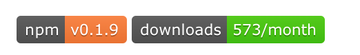
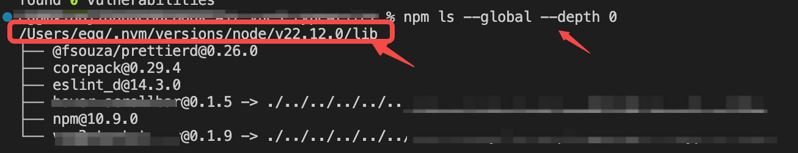

\---

outline: deep

\---

# 发布自己的 npm包

构建一个完整的组件并发布 npm 包并通过 npm 安装使用。避免在不同项目中不停的复制粘贴～

## 一、构建 `vue3` 组件并发布

### 1. 创建基础的vite脚手架

```shell
pnpm create vite your-package-name --template vue-ts
```

- 关于创建项目更多的细节可以参考我的另外一篇笔记：【**搭建一个vue脚手架**】

### 2.  删除多余的文件

- 清空`APP.vue`文件内容
- 删除`src/components`下的文件，后续自己新建
- 删除`src/assets`下的文件

### 3. 安装必要的依赖

- 这两个插件是为了能解析 vue 和 ts/es 语法，如果通过脚手架命令创建项目后发现没有这两个依赖的话请手动安装

  ```shell
  pnpm add @vitejs/plugin-vue @types/node -D
  ```

- 这个插件是为了解决 ts 类型的问题：用于在 库模式 中，从 .ts(x) 或 .vue 源文件生成类型文件（.d.ts）的 Vite 插件

  ```shell
  pnpm add vite-plugin-dts -D
  ```

- 这个插件是为了减小包体积，以及做一些打包自定义处理，具体处理参数可以[参考官网](https://terser.org/docs/api-reference/)

  ```shell
  pnpm add terser -D
  ```

- 另外关于代码格式化的插件可以自选安装，配置方法可以参考我的另外一篇笔记：【**搭建一个vue脚手架**】

### 4. 创建组件

- 在`src/components`下创建封装的组件文件，比如`ExampleDom.vue`：

  ```vue
  <template>
    <div>{{ example }}</div>
  </template>
  
  <script lang='ts'>
  import { defineComponent, ref } from 'vue';
  
  export default defineComponent({
    name: 'ExampleDom', // 一定要有 name
    setup() {
      const example = ref('hello world!');
      return {
        example,
      };
    },
  });
  </script>
  
  <!-- 如果使用了 setup 语法糖也一定要为组件命名，如下：-->
  <script lang='ts' setup>
  import { ref } from 'vue';
  
  defineOptions({
    name: 'ExampleDom'  // 一定要有 name
  });
    
  const example = ref('hello world!');
  </script>
  ```

### 5. 预览组件

- 在`APP.vue`中引用组件

  ```vue
  <template>
    <div>
      <example-dom />
    </div>
  </template>
  <script setup>
  </script>
  ```

  预览组件没有问题之后就可以进行下面的发布配置了。

### 6. 创建入口文件

- 在`src`下面创建`index.ts`文件

  ```ts
  import type { App } from 'vue';
  import ExampleDom from '../src/components/ExampleDom.vue';
  // import ExampleDom1 from '../src/components/ExampleDom1.vue'; // 如果有多个组件一起打包
  
  const components = [ExampleDom];
  // const components = [ExampleDom, ExampleDom1]; // 如果有多个组件一起打包
  
  export { ExampleDom }; // 按需引入
  // export { ExampleDom, ExampleDom1 }; // 按需引入，如果有多个组件一起打包就可以一起写
  
  const install = (app: App<any>) => {
    components.forEach((component) => {
      app.component(component.name as string, component);
    });
  };
  export default { install };
  
  ```

### 6. 修改打包配置

- 修改`vite.config.ts`文件

  ```ts
  import { defineConfig } from 'vite';
  import vue from '@vitejs/plugin-vue';
  import path from 'path';
  import dts from 'vite-plugin-dts';
  
  export default defineConfig({
    plugins: [
      vue(),
      dts({
        outDir: 'dist', // 打包文件名
        insertTypesEntry: true,
        include: ['src']
      })
    ],
    build: {
      emptyOutDir: false, // 避免dist被清空
      lib: {
        entry: path.resolve(__dirname, 'src/index.ts'), // 入口文件
        name: 'example', // // 暴露的全局变量的名字，这个名字可以自定义，最好是你的包的名字
        fileName: (format) => `example.${format}.js` // 输出的文件名，这里和上面的 name 最好保持一致
      },
      rollupOptions: {
        external: ['vue'], // 把不想打包进你的包的包排除掉
        output: {
          format: 'es',
          // 在 UMD 构建模式下为这些外部化的依赖提供一个全局变量
          globals: {
            vue: 'Vue'
          },
          exports: 'named' // 使用命名模式导出，也可以不设置即使用默认模式。二者的区别就是使用组件时是否要带{}: import { example } from "example"; or import example from "example"
        }
      },
      // 可选commonjsOptions: 用于将CommonJS模块转换为ES模块
      // 因为rollup只能打包ES模块，如果要打包CommonJS模块，就需要使用@rollup/plugin-commonjs插件
      commonjsOptions: { // @rollup/plugin-commonjs 插件的选项
        transformMixedEsModules: true // 是否转换混合的ES模块
      },
      sourcemap: true,
      // 以下都是打包配置，可按需自定义
      minify: 'terser',
      terserOptions: {
        compress: {
          drop_console: true,
          drop_debugger: true
        },
        format: {
          comments: true
        }
      }
    }
  });
  
  ```

### 7. 修改`tsconfig.json`文件

- vite 脚手架创建出来的项目有 3 个` tsconfig` 相关文件: ` tsconfig.app.json`、`tsconfig.node.json`、`tsconfig.json`。我们删掉前两个，只保留`tsconfig.json`并做以下修改：

  ```json
  {
    "compilerOptions": {
      "target": "ES2020",
      "useDefineForClassFields": true,
      "module": "ESNext",
      "lib": ["ES2020", "DOM", "DOM.Iterable"],
      "skipLibCheck": true,
      "moduleResolution": "node",
      "jsx": "preserve",
      "sourceMap": true,
      "esModuleInterop": true,
      "resolveJsonModule": true,
      "isolatedModules": true,
      "declaration": true,
      "declarationDir": "./dist", // 这个是打包输出文件路径
      "outDir": "./dist", // 这个是打包输出文件路径
      "strict": true,
      "noUnusedLocals": true,
      "noUnusedParameters": true,
      "noImplicitReturns": true,
      "noFallthroughCasesInSwitch": true,
      "allowSyntheticDefaultImports": true,
      "types": ["vite/client", "vue"]
    },
    "include": ["src", "vite.config.ts"],
    "exclude": ["node_modules", "dist"]
  }
  
  ```

### 8. 修改`package.json`文件，做发布准备

- `package.json`中需要标明包名称、版本、搜索关键字和重要的文件配置，如下：

  ```json
  /** 补充说明 **/
  // 1. 这里的name和components文件中的name不需要一致：
  // - 但是这个name 就是发布包的名字，即npm下载时将使用这个名字。
  // 2. version 版本更新规则：
  // - 小变动，比如修复bug等，版本号变动 v0.1.0->v0.1.1
  // - 增加新功能，不影响现有功能,版本号变动 v0.1.3->v0.2.0
  // - 破坏模块对向后的兼容性，版本号变动 v0.1.2->v1.0.0
  // 3. 许可证的选择可以参考这个网址：https://choosealicense.com/，可以直接复制对应的许可内容
  
  
  {
    "name": "npm-package-name", // 如果name重复或者相似则无法发布，发布之前做好去 npm 搜索一下 name 是否存在
    "version": "0.1.0", // 首次发布建议使用 0.1.0 开始编号
    "description": "你发布包的描述",
    "type": "module",
    "files": [
      "dist/*"
    ],
    "main": "dist/example.umd.js",
    "module": "dist/example.es.js",
    "types": "dist/index.d.ts",
    "publishConfig": {
      "access": "public"
    },
    "exports": {
      ".": {
        "types": "./dist/index.d.ts",
        "import": "./dist/example.es.js",
        "require": "./dist/example.umd.js"
      }
    },
    "scripts": {
      "dev": "vite",
      "build": "vue-tsc -b && vite build",
      "preview": "vite preview"
    },
    "dependencies": {
      "vue": "^3.5.13"
    },
    "devDependencies": {
      "@types/node": "^22.10.6",
      "@vitejs/plugin-vue": "^5.2.1",
      "@vue/tsconfig": "^0.7.0",
      "terser": "^5.37.0",
      "typescript": "~5.6.2",
      "vite": "^6.0.5",
      "vite-plugin-dts": "^4.5.0",
      "vue-tsc": "^2.2.0"
    },
    "keywords": [
      "Vite",
      "Vue3",
      "TypeScript",
      "Web",
      "其他关键字",
      "..."
    ],
    "author": "发布包的作者名（你的昵称/名字）",
    "engines": {
      "node": ">=20"
    },
    "browserslist": [
      "> 1%",
      "not ie 11",
      "not op_mini all",
      "not dead"
    ],
    "repository": {
      "type": "git",
      "url": "项目的 github 地址（如果有的话）" // 和 github 关联
    },
    "license": "MIT", // 选择合适的许可
  }
  ```

### 8. 编写`README.md`和`LICENSE`文件

- `readme.md`文件主要写组件下载、使用说明

  ```md
  // 发布之后可以在 readme中添加以下链接，可以显示 npm版本 和 包月下载量
  [](https://www.npmjs.com/package/<package-name>)
  [](https://www.npmjs.com/package/<package-name>)
  ```

  

  > 如果想在 readme中放一些说明图片，本地地址（相对和绝对的都有点问题）在发布之后是无法预览的，需要将图片转为在线地址再填写到 md 文件中。这里提供一个简单的方法：
  >
  > 1. 可以创建一个存储图片的 github 项目，或者 npm包本身就有对应的 github；
  > 2. 在上传到 github后，找到图片所在位置，右键选择复制图片地址，将这个地址放到 readme 文档中即可
  > 3. ⚠️注意：https://github.com/star-devil/xxxx/xxx?raw=true，链接后面有 raw=true 才是对的

- `lisense`文件是许可内容，可以复制模板或自己定义规则

### 9. 打包

- 运行打包命令生成`dist`文件夹

  ```shell
  pnpm build
  ```

### 10. 本地验证包

- 打包完成后我们可以先发布本地测试包，在别的项目中下载包进行测试。避免打包的文件错误就发布了。

  ```shell
  # 在发布包文件终端执行以下命令
  npm link
  
  # 在测试项目中执行以下命令
  # 测试项目可以是新建的vue项目，也可以是别的正在使用的vue项目
  npm link <package-name>
  
  # 如果上述代码半天链接不上包，可以使用下面的命令进行手动连接（地址需更换）
  ln -s /Users/egg/.nvm/versions/node/v22.12.0/lib/node_modules/<package-name>
  
  # 链接成功后如果 npm 包不在测试项目的 node_modules 文件中，需要手动移入
  # 链接成功后，npm包有修改运行打包命令后，测试项目中的代码会自动更新，无需再次链接
  ```

- 手动链接地址获取方法：

  `/Users/egg/.nvm/versions/node/v22.12.0/lib`这个地址可以通过查看创建的全局链接（下面有写）得到:

  

- 其他相关命令

  ```shell
  # 在测试项目中去除软链
  npm unlink <package-name>
  
  # 在pm包所在文件目录下取消发布npm包的测试软链
  npm unlink
  
  # 强制解除创建的某个特定全局链接
  sudo npm rm --global <package-name>
  
  # 查看所有创建的全局链接名称，得到结果的第一行就是链接所在地址
  npm ls --global --depth 0
  ```

  

### 11. 发布

- 本地验证可以正确使用组件后就可以发布了

- npm登录

  ```shell
  npm login
  
  # 如果没有 npm 账号需要先注册
  # 用户名、密码、和邮箱
  
  # 登录时会发送一封邮件到邮箱，有一个动态验证码
  ```

- 发布

  ```shell
  # 发布时可以为当前版本添加tag,一共有 3 种：beta/latest/stable
  ## beta 预发布版本，一般用于标记包的测试版本或预发布版本，别人在非指定的情况下不会下载到这个版本
  ## latest 是npm的默认标签，通常代表包的最新稳定版本，是在安装包时默认获取的版本
  ## stable 通常用于明确标记包的稳定版本。虽然 latest 也代表稳定版本，但 stable 可以指向经过长期测试和验证的特定稳定版本。
  
  # 默认直接发布为 latest/最新 tag 版本：
  npm publish
  # 指定发布版本 tag：
  npm publish --tag beta/latest/stable
  # 或者把 dist-tags添加到特定版本：
  npm dist-tag add packagename@xx.xx.xx stable
  
  # 卸载 npm 包命令：
  npm unpublish <package-name>  -f
  
  # 更新包！！
  ## MAJOR.MINOR.PATCH（主版本号.次版本号.补丁版本号）
  
  # 自动更新补丁版本号
  npm version patch 
  # 自动更新次版本号
  npm version minor
  # 自动更新主版本号
  npm version major
  
  # 每次更新前需要先打包！！！
  # 每次更新前需要修改 package.json 的版本号，上述更新命令可以自动修改版本号，否则请手动修改
  
  ```

### 12. 下载使用


## 二、创建 `js` 应用并发布

### 1. 创建基础的vite脚手架

```shell
pnpm create vite your-package-name --template
```

- 开发框架选择`Others`-> `Extra Vite Starters`->`library`->`js or ts`自己选择
- `library`就是软件库
- 创建好之后你会发现`vite.config.ts`和 `package.json`已经完成了发布的基础配置了
- vue组件发布也可以使用这个流程，只是vue相关的环境需要自己配置

### 3. 下载相关依赖和添加额外的配置

- 我使用了ts语法，所以下载了`@types/node`

### 4. 编写组件

- 在入口文件中定义组件并导出
- 不同的库有不同的逻辑，这里没有统一的定义和导出方法

### 5. 发布

- 测试发布和发布流程和上述发布vue组件相同