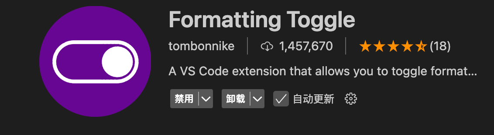
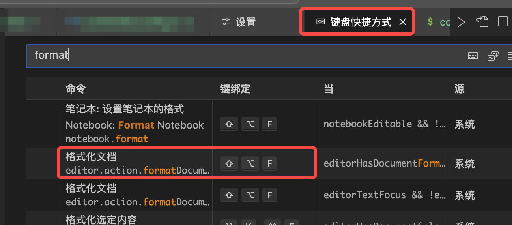
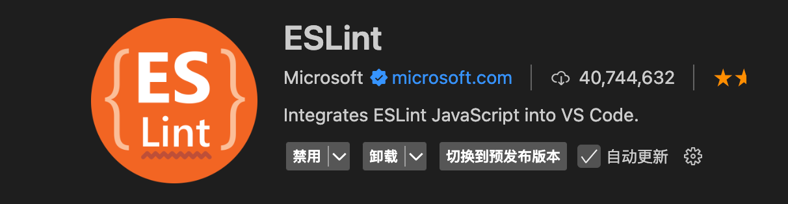
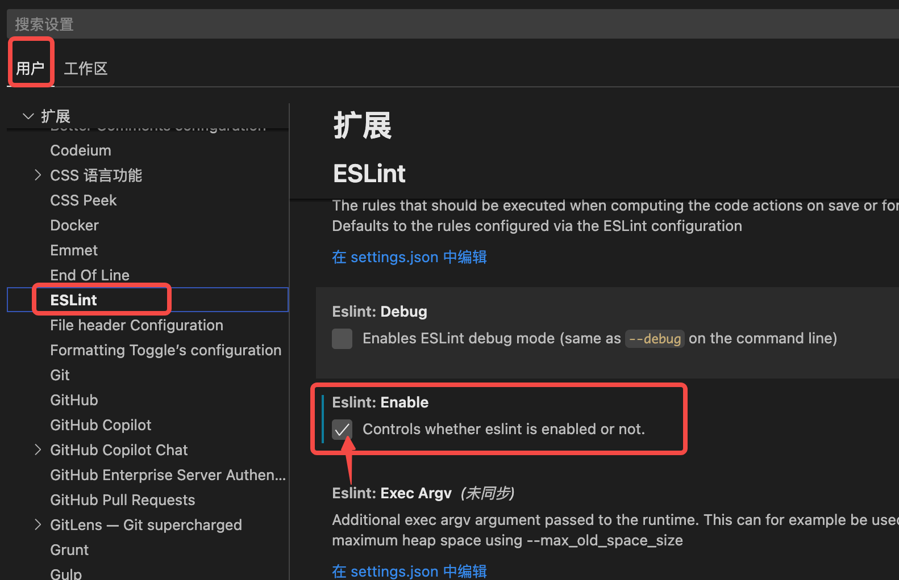
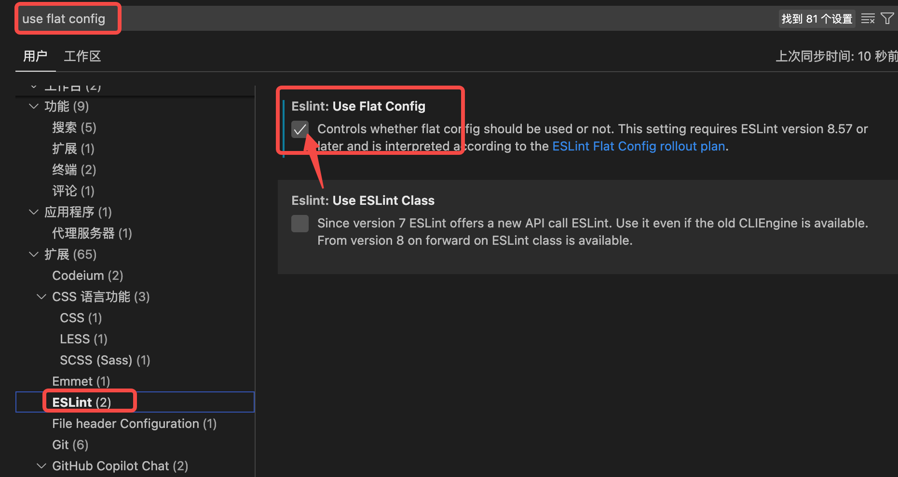

# 搭建一个开箱即用的脚手架


## 一、初始搭建

::: tip 请注意 node版本

Vite 需要 [Node.js](https://nodejs.org/en/) 版本 18+ 或 20+。然而，有些模板需要依赖更高的 Node 版本才能正常运行，当你的包管理器发出警告时，请注意升级你的 Node 版本。

:::


### 方法一：使用 vite 脚手架搭建

```shell
pnpm create vite

# 然后按照提示操作即可！
```

**or**

```shell
pnpm create vite my-vue-app --template vue-ts

# 通过附加的命令行选项直接指定项目名称和你想要使用的模板。
# 这里我构建的是 Vite + Vue-ts项目。
# 此文档编辑时间为24年11-12月，创建的vite版本为^5.4.10

##  其他模板：
## vanilla，vanilla-ts, vue, vue-ts，react，react-ts，react-swc，react-swc-ts，preact，preact-ts，lit，lit-ts，svelte，svelte-ts，solid，solid-ts，qwik，qwik-ts
```


### 方法二：手动安装

    `pnpm add -D vite` 并创建一个 `index.html` 文件。相关操作不做更多介绍


> [!NOTE]
>
> **执行成功之后即可得到一个初始框架项目，但是想要高效开发还远远不够....**


## 二、 安装sass


- 安装的`sass`，项目开发使用的是`scss`语法，因为scss和css语法书写方式类似

- `sass`基于`Ruby`语言开发而成，因此 [安装](https://www.sass.hk/install/#)`sass`前需要[安装`Ruby`](http://rubyinstaller.org/downloads)。（注：mac下自带Ruby无需在安装Ruby！window请参考[官网教程]([安装Sass | Sass中文网](https://www.sass.hk/install/))）

> scss是sass3引入的新语法，其实是一个东西，平时都称之为sass，[二者的区别]([Sass和Scss的区别这是我参与11月更文挑战的第19天，活动详情查看：2021最后一次更文挑战 题目 给你二叉树的根 - 掘金](https://juejin.cn/post/7033331497054519327))

### 1. 安装

```shell
pnpm add sass-embedded -D

# sass-embedded:该包是sass包的替代品。
# 它支持与sass相同的 JS API，并由同一团队维护，但sass包是纯 JavaScript
# 而sass-embedded是围绕本机 Dart 可执行文件的 JavaScript 包装器。
# 这意味着sass-embedded通常会更快，特别是对于大型 Sass 编译，
# 但它只能安装在 Dart 支持的平台上：Windows、Mac OS 和 Linux。
```


### 2. 配置

- 使用`VITE 7`以下的版本默认使用的 sass API 是`lagacy api`，此api将在sass2.0废弃，建议使用api： modern-compiler；

- 如果下载了`sass-embedded`，则默认`api`为`modern-compiler`；官方建议`modern-compiler`和`sass-embedded`搭配使用，以获得更高的性能，需要在`vite.config.ts`配置以下代码：

```ts
export default defineConfig({
  // ...其他配置
  css: {
    preprocessorOptions: {
      scss: {
        api: 'modern-compiler'
      }
    }
  },
  // ..其他配置
})
```


## 三、配置代码检查和格式化

> 使用各种lint和format插件，提高代码质量

### 1. 添加代码格式化扩展

::: tip 作用

代码格式化工具可以使编码更专注，在协同开发时统一代码风格十分有用

:::

1. 安装 [prettier]([什么是 Prettier？ · Prettier 中文网](https://prettier.nodejs.cn/docs/en/index.html)) 扩展`(v3.x)`： 代码美化

   ```shell
   pnpm add --save-dev --save-exact prettier
   ```

   

2. 创建配置文件

   ```shell
   node --eval "fs.writeFileSync('.prettierrc','{}\n')"
   
   # 这将会在项目中添加一个空的配置文件，告诉编辑器和其它工具已经启用`Prettier`
   ```

   - 命令执行成功之后可在项目根目录发现文件`.prettierrc`，可以为配置文件添加以下简单内容（缩进默认为2个空格，就没有再进行设置，更多参数默认值请看[文档]([Options · Prettier](https://prettier.io/docs/en/options))）：
     
     
     
     ```json
     {
       "jsxSingleQuote": false, // 在JSX中使用双引号
       "singleQuote": true, // 在普通代码中使用单引号
       "endOfLine": "lf", // 设置行尾字符为换行符（Line Feed，LF）
       "semi": true, // 在语句末尾添加分号
       "trailingComma": "none", // 在对象、数组、函数的最后一个参数后不添加逗号。如果设置为es5表示末尾要添加逗号，且遵循ES5标准。
       "insertPragma": true, // 在文件头增加是否已经格式化的注释
       "requirePragma": false // 默认值为false,初始可以不设置。设置为true时需要与inserPragma搭配使用,当逐渐将大型、未格式化的代码库过渡到 Prettier 时，设置为true会非常有用
     }
     ```
     
     
     
   - `pnpm exec prettier . --write` 格式化所有内容
     
     - 如果某些文件格式化没有生效，比如缩进还是4个空格，请检查编辑设置是否冲突；比如VScode，可以在编辑的`setting.json`中检查比如json文件是否使用了其他格式器：
       
       ```json
       "[json]": {
         "editor.defaultFormatter": "xxxx"
       }
       ```
     
     - 或者你的配置文件如果使用了`useTab:true`，就算设置了`tabWidth:2`，某些文件也会使用4个空格的制表符

   - `npx prettier . --check` 检查文件是否已经格式化

     

3. 通过编辑器运行`Prettier`

   

   :::tip 以`vscode`为例说明

   配置成功后可以通过键盘快捷键或者保存文件时自动运行。另外，编辑器插件将选择你本地版本的 Prettier，确保你在每个项目中使用正确的版本。[编辑器配置文档]([编辑器集成 · Prettier 中文网](https://prettier.nodejs.cn/docs/en/editors.html#google_vignette))

   :::

   

   - 在`vscode`中安装插件 `prettier-vscode`

   - 安装好后再介绍界面点击**齿轮**图标会出现一个菜单，选择**设置**可进入配置编辑页面，每一个配置都有对应解释，可以根据自己需要进行设置，或者打开编辑器`setting.json`文件编辑。

   - 我设置后的setting.json文件如下：
     
     ```json
     // prettier扩展配置
     "editor.defaultFormatter": "esbenp.prettier-vscode",
     "prettier.bracketSameLine": true,
     "prettier.vueIndentScriptAndStyle": true,
     "prettier.jsxSingleQuote": false,
     "prettier.singleQuote": true,
     "prettier.trailingComma": "none",
     "prettier.insertPragma": true,
     "prettier.requirePragma": false,
     "[vue]": {
       // 无论默认格式化器是什么，都使用 prettier
       "editor.defaultFormatter": "esbenp.prettier-vscode" 
     },
     ```
     
     - 当`setting.json`和`.prettierrc`存在冲突时，通常情况下会以`.prettierrc`优先，但是如 `editor.tabSize` 或 `editor.insertSpaces`可能会在特定场景中影响格式化，还有上文提到的为特定文件类型定义格式化设置（如 `"[json]"`）。如果这样设置，编辑器可能会在格式化特定文件类型时优先使用这些设置，而不遵循 `.prettierrc` 配置。
     - 如果项目中不存在`.prettierrc`文件时，`setting.json`将作为后备格式器美化代码格式。

   - 配置好后如果你想开启**保存**文件时**自动格式化**，需要在`setting.json`中添加：
     
     ```json
     // 保存时格式化当前文件（具体取决于 Prettier 本身支持的语言）
     "editor.formatOnSave": true
     // 如果你只想在保存时格式化指定的文件，如JavaScript：
     "editor.formatOnSave": false
     "[javascript]": {
         "editor.formatOnSave": true
     }
     ```

   - 如果想开启使用键盘快捷键格式化当前文件，或者当前选中代码，需要下载一个插件（VScode）：`Formatting Toggle`，下载好之后启用插件。
     


   - 官方文档格式化快捷键是 (`CMD + SHIFT + P`/`OPT + SHIFT + P`)，如果没有生效，你就需要检查一下你自己的编辑器格式化代码的快捷键是怎么定义的，检查方法：通过快捷键`Ctrl + K, Ctrl + S`或`Cmd + K, Cmd + S`打开键盘快捷键设置，搜索格式或者format，可以看到我的格式化快捷键是：`SHIFT + CMD + F`
     

     

   - 如果你的项目中有`.editorconfig` ，Prettier 会对其进行解析，并将其属性转换为对应的 Prettier 配置。此配置会被 `.prettierrc` 等覆盖。

   - （共享 Prettier 配置很简单：只需发布???一个导出配置对象的模块，比如 `@company/prettier-config`，并在你的 `package.json` 中引用它：）

     

### 2. 添加代码校验扩展

> - 使用 Prettier 来解决代码格式问题，使用 linter 来解决代码质量问题。
>
> - 但是Linters 通常不仅包含代码质量规则，还包含风格规则。
>
> - 使用 Prettier 时，大多数风格规则都是不必要的，但更糟糕的是——它们可能与 Prettier 发生冲突！下面使用的是官方提供的解决方案：


1. 安装`eslint` v9.x

   9.0版本弃用和删除了大量的API和规则，包括配置文件更新，Flat 取代 eslintrc。

   关于查询具体规则，除了可以查看文档，我强烈推荐使用[@eslint/config-inspector](https://link.juejin.cn/?target=https%3A%2F%2Fgithub.com%2Feslint%2Fconfig-inspector "https://github.com/eslint/config-inspector")，它目前已经被eslint内置，我们只需在项目中运行`npx eslint --inspect-config`，就会启动一个网页 ，可以很方便的查看已配置的插件和规则；

   如需要从旧版本升级，请前往官网查看迁移方法。另外，ESlint9.0支持的Node.js版本是LTSv18.18.0+和v20，不支持v19以及之前的所有版本。

   ```
   pnpm create @eslint/config@latest
   
     ## 根据提示选择适合你项目的选项:
   
     (1) How would you like to use ESLint?
     选择：To check syntax and find problems
   
     (2) What type of modules does your project use?
     选择：JavaScript modules (import/export)
   
     (3) Which framework does your project use?
     选择：Vue.js
   
     (4) Does your project use TypeScript?
     选择：Yes
   
     (5) Where does your code run?
     选择：Browser
   
     (6) What format do you want your config file to be in?
     选择：JavaScript
   
     (7) Would you like to install them now?
     选择：Yes
   
     (8) Which package manager do you want to use?
     选择：pnpm
   
     ## 最后我的项目下载了这些依赖：
     ## + @eslint/js 9.14.0
     ## + eslint 9.14.0
     ## + eslint-plugin-vue 9.30.0
     ## + globals 15.12.0
     ## + typescript-eslint 8.13.0
   
     ## 并且项目根目录下增加了eslint.config.js文件
   ```

   

2. 安装插件：以下是与`eslint`配合使用的扩展插件，且支持扁平模式

   ```shell
   # 在 Vite 项目中集 ESLint,在每次保存文件时自动运行 ESLint 检查
   pnpm add vite-plugin-eslint2 
   
   # 解决prettier和eslint规则冲突的插件
   
   ## 基于 prettier 代码风格的 eslint 规则
   pnpm add -D eslint-plugin-prettier
   
   ## 禁用所有与格式相关的 eslint 规则，解决 prettier 与 eslint 规则冲突，确保将其放在 extends 队列最后，这样它将覆盖其他配置
   pnpm add -D eslint-config-prettier 
   
   ## eslint的其他规范化插件
   pnpm add -D @eslint/markdown
   ```

   

3. 在`eslint.config.js`中添加一些基础的校验规则，新版本配置文件同时还弃用了`.eslintignore`文件

   ```js
   import globals from 'globals';
   import pluginJs from '@eslint/js';
   import tseslint from 'typescript-eslint';
   import pluginVue from 'eslint-plugin-vue';
   import prettierPlugin from 'eslint-plugin-prettier';
   import eslintConfigPrettier from 'eslint-config-prettier';
   import markdown from "@eslint/markdown";
   
   export default [
     { files: ['**/*.{js,mjs,cjs,ts,vue}']},
     {
       // 忽略检查的文件写在这里
       ignores: [
         '**/node_modules/**',
         '**/dist/**',
         '**/build/**',
         '.git',
         '.vscode',
         '.husky',
         'Dockerfile',
         'package-lock.json',
         'pnpm-lock.yaml'
       ]
     },
     // `languageOptions` 配置了浏览器环境下的全局变量。
     {
       languageOptions: {
          // 使用最新的 ECMAScript 语法
         ecmaVersion: 'latest',
          // 代码是 ECMAScript 模块
         sourceType: 'module',
         globals: globals.browser 
       }
     },
     // recommended文件中已设置了很多规则，可以根据官网说明在rules中自行添加或修改一些规则
     // https://eslint.org/docs/latest/rules
     // https://typescript-eslint.io/rules
     // https://eslint.vuejs.org/rules/
     pluginJs.configs.recommended,
     ...tseslint.configs.recommended,
     ...pluginVue.configs['flat/essential'],
     ...markdown.configs.recommended,
     {
       files: ['**/*.vue'],
       languageOptions: {
         parser: pluginVue.parser, // 用于解析 <template> 中的 Vue 模板
         parserOptions: {
           ecmaVersion: 'latest',
           sourceType: 'module',
           parser: tseslint.parser, // 用于解析 <script> 中的 TypeScript
           ecmaFeatures: {
             jsx: true,
             tsx: true
           }
         }
       }
     },
     // 自定义的rules规则
     {
       rules: {
          // 不允许使用var定义
         'no-var': 'error',
          // 强制在可能的情况下使用const声明变量，而不是 let
         'prefer-const': 'error',
          // 允许catch空着
         'no-empty': ['error', { allowEmptyCatch: true }]
       }
     }
   ]
   ```

   

4. 在`vite.config.ts`中配置eslint插件

   ```ts
   // 在启动项目和打包代码时进行代码检查, 如果检查有error类型的问题就启动或打包失败, warn类型的问题不影响启动和打包
   import eslint from 'vite-plugin-eslint2';
   // https://vite.dev/config/
   export default defineConfig({
     plugins: [eslint({ lintOnStart: true, cache: false, fix: true })]
   });
   ```

   

5. 现在可以使用命令检查和修复文件的代码语法：

   ```shell
   npx eslint yourFilesPath(eg:./src/App.vue) ## 检查指定文件
   npx eslint yourFilesPath(eg:./src/App.vue) --fix ## 修复
   
   ## or 
   pnpm eslint . ## 检查所有文件
   pnpm eslint . --fix ## 修复
   ```

   

6. 通过编辑器运行`eslint`

   

   执行上述命令后，如果代码不符合规则约定的话，会发现终端会输出错误。但是编辑器并没有出现预期的红色波浪线提示，或者保存时自动修复错误。如果每次都需要执行命令才能检测那么效率也太低了，所以需要和`prettier`一样在编辑器中运行`eslint`

   

   - 安装插件`eslint`扩展插件
     
     

   - 勾选开启使用插件
     
     

   - 勾选开启扁平模式（打开设置搜索use flat config）
     
     

   - 下面是我编辑器setting.json关于eslint的配置

   ```json
   // eslint配置
    "eslint.useFlatConfig": true,
    "eslint.enable": true,
    "eslint.run": "onType",
    "eslint.validate": [
      "javascript",
      "javascriptreact",
      "typescript",
      "typescriptreact",
      "vue",
      "html",
      "json",
      "markdown"
    ],
    "eslint.codeAction.showDocumentation": {
      "enable": false
    },
   ```


### 3. 添加style样式代码格式化扩展（css、scss、less）

> css的lint工具是`stylelint`，用于检查css语法错误或者不合理的地方，也可以约束css书写顺序。注意，15版本的stylelint已经取消关于格式方面的约束规则，格式化全部交给了prettier。
> 
> 我项目里用的是scss，接下来的配置与scss相关，其他预处理器的配置都差不多，只是下载的扩展不一样。

1. 安装`stylelint`和`scss`配置
   
   ```shell
   pnpm add -D stylelint # 当前是V16.0.0
   pnpm add -D stylelint-config-standard-scss # 扩展stylelint-config-standard 和 stylelint-config-recommended-scss 共享配置
   pnpm add -D postcss-html # 用于解析 HTML（和类 HTML<style>）的 PostCSS语法，下面两个扩展会依赖这个插件（vite已经内置postcss，无需再单独下载）
   pnpm add -D stylelint-config-standard-vue # 提供 Vue 的相关规则
   pnpm add -D stylelint-config-html # 提供 Html 的相关规则
   
   # 按照recess和bootstrap方式对css属性进行排序的插件（也可以自己定义规则）
   pnpm add -D stylelint-config-recess-order
   ```

2. 创建`.stylelintrc.json`文件：
   
   ```json
   // 标准配置开启了大约一半的内置规则,平时开发够用了，如果有特殊需求可以用rules自定义
   {
     "extends": [
       "stylelint-config-standard-scss",
       "stylelint-config-standard-vue/scss",
       "stylelint-config-html",
       "stylelint-config-recess-order"
     ],
     "overrides": [
       {
         "files": ["*.html", "**/*.html"],
         "customSyntax": "postcss-html"
       }
     ],
     "ignoreFiles": [
       "dist/**/*",
       "node_modules/**/*",
       "**/*.js",
       "**/*.jsx",
       "**/*.tsx",
       "**/*.ts",
       "**/*.json",
       "**/*.md",
       "**/*.yaml"
     ],
     // 需要时使用配置注释来禁用特定规则
     "reportDescriptionlessDisables": true,
     "reportInvalidScopeDisables": true,
     "reportNeedlessDisables": true
   }
   ```

3. 对项目中所有的scss文件运行stylelint:
   
   ```shell
   npx stylelint "**/*.scss" #检查
   npx stylelint "**/*.scss" --fix #修复
   ```

4. 同样的，保存时自动修复需要在编辑器中安装`stylelint`扩展
   
   
   
   然后在编辑器（vscode）的`setting.json`文件中加入以下配置：
   
   ```json
    "editor.codeActionsOnSave": {
       ...
       "source.fixAll.stylelint": "explicit"
    },
    // 取消系统默认的检查
    "css.validate": false,
    "less.validate": false,
    "scss.validate": false,
    "stylelint.ignoreDisables": true,
    "stylelint.validate": ["css", "scss", "less", "sass", "vue", "html"]
   ```

> 完成以上配置之后即可在编辑代码的过程中随时保证代码质量和代码格式。

5. 同时可以在`package.json`中添加手动检查、修复的命令，可在终端手动执行

   ```json
   "scripts": {
     ...
     "lint:eslint": "eslint . --ext .vue,.js,.ts,.tsx,.jsx --fix",
     "lint:stylelint": "stylelint --fix \"./**/*.{html,vue,css,scss}\""
     "lint:prettier": "prettier --write  \"./**/*.{js,ts,json,tsx,css,scss,vue,html,md}\"",
     ...
   },
   ```

   

## 四、 添加Git Hook

> 在git提交前再进行一次代码检查

### 1.  husky、lint-staged、@commitlint/cli

1. `husky`:Husky 是一个 Git Hook 工具，可以帮助我们在 Git 事件发生时自动[运行脚本](https://so.csdn.net/so/search?q=%E8%BF%90%E8%A1%8C%E8%84%9A%E6%9C%AC&spm=1001.2101.3001.7020)。Git Hook 是一种机制，它允许在 Git 执行操作时自动运行特定脚本，以执行自定义操作。

2. `lint-staged`是一个工具，可以在 Git 暂存区的文件上运行指定的 lint 工具，以便于仅在需要时执行 lint 检查。它通常与 Husky 配合使用，以在提交代码前运行 lint-staged。

3. `@commitlint/cli`是一个命令行工具，用于校验 Git 提交信息是否符合规范。它通常与 Husky 和 lint-staged 配合使用，以在提交代码前对提交信息进行校验，从而确保提交信息的格式和内容符合项目规范和约定。

### 2. 具体使用

1. 安装
   
   ```shell
   pnpm add husky -D
   pnpm add lint-staged -D
   pnpm add @commitlint/cli @commitlint/config-conventional -D
   ```

2. 初始化`husky`
   
   > 这里初始化之后会在根目录添加一个`.husky`文件夹，里面有一个`pre-commit`文件和一个`_`文件夹。简单配置用不上`_`文件夹的内容且是不会提交git的，我就删掉了
   
   ```shell
   pnpm exec husky init
   ```

3. 在`pre-commit`中添加以下内容，用于提交前进行代码校验
   
   ```shell
   #!/usr/bin/env sh
   
   pnpm lint-staged
   ```

4. 手动在项目根目录添加`commitlint.config.ts`文件，用于编写提交信息的校验规则：
   
   ```ts
   module.exports = {
     ignores: [(commit) => commit.includes('init')],
     extends: ['@commitlint/config-conventional'],
     rules: {
       'body-leading-blank': [2, 'always'],
       'footer-leading-blank': [1, 'always'],
       'header-max-length': [2, 'always', 108],
       'subject-empty': [2, 'never'],
       'type-empty': [2, 'never'],
       'subject-case': [0],
       'type-enum': [
         2,
         'always',
         [
           'feat', //新功能(feature)
           'fix', // 修复bug
           'perf', // 性能优化
           'style', // 不影响代码运行的变动
           'docs', // 文档
           'test', // 测试(单元,集成测试)
           'refactor', // 重构
           'build', // 编译相关的修改，例如发布版本，对项目构建或者依赖的改动
           'ci', // 自动化流程配置或脚本修改
           'chore', // 构建过程或者辅助工具的变动,如增加依赖库等
           'revert', // 撤销commit,回滚到上一个版本
           'wip',
           'workflow',
           'types',
           'release'
         ]
       ]
     }
   };
   ```

5. 手动添加`commit-msg`文件
   
   在上一步生产的`.husky`文件夹下，创建一个和`pre-commit`同级的`commit-msg`文件，用于检验提交信息。添加以下内容：
   
   ```shell
   #!/usr/bin/env sh
   . "$(dirname -- "$0")/_/husky.sh"
   
   npx --no -- commitlint --edit ${1}
   ```

6. 在`package.json`中配置`lint-staged`
   
   ```json
   {
    "scripts": {
       "commitlint": "commitlint --config commitlint.config.ts -e -V",
       "prepare": "husky install",
       "preinstall": "npx only-allow pnpm"
     }, 
    "lint-staged": {
       "*.{js,jsx,ts,tsx}": [
         "eslint --fix",
         "prettier --write"
       ],
       "*.json": [
         "prettier --write"
       ],
       "*.vue": [
         "eslint --fix",
         "prettier --write",
         "stylelint --fix"
       ],
       "*.{scss,less,styl,html}": [
         "stylelint --fix",
         "prettier --write"
       ],
       "*.md": [
         "prettier --write"
       ]
     }
   }
   ```

## 五、添加其他插件/配置

> 提高代码编写效率

### 1. 使用文件路径别名

1. 使用自定义符号代替指定路径，简化模块导入路径。
   
   ```shell
   pnpm add @types/node --save-dev
   ```

2. 进入`vite.config.ts`
   
   ```js
   import path from 'path'
   
   export default defineConfig({
   ......
   resolve: {
	// alias 别名配置不仅在 JavaScript 的 import 语句中生效，在 CSS 代码的 `@import` 和 `url`导入语句中也同样生效。
     alias: {
         '@': path.resolve(__dirname, 'src'), // @代替src
         '@c': path.resolve(__dirname, 'src/components'),
         '@assets': path.resolve(__dirname, 'src/assets')
         // 可根据后续开发情况自行添加
         },
     },
   })
   ```

### 2. 自动导入ref等hook

> 使用ref、reactive、computed等时不再需要手动import

1. 下载`unplugin-auto-import`插件
   
   ```shell
   pnpm add -D unplugin-auto-import    
   ```

2. `vite.config.ts`中配置
   
   ```ts
   // vite.config.ts
   import AutoImport from 'unplugin-auto-import/vite'
   
   export default defineConfig({
     plugins: [
       AutoImport({
           imports: ['vue', 'vue-router', 'pinia'],
           dts: './auto-import.d.ts',
           eslintrc: {
               // 已存在文件设置默认 false，需要更新时再打开，第一次使用请设置为true
               enabled: false,
               filepath: './.eslintrc-auto-import.json',
               globalsPropValue: true
           }
       }),
     ],
   })
   ```
   
    设置完成之后根目录会自动生成`auto-import.d.ts`和`.eslintrc-auto-import.json`两个文件，如果没有就运行一下项目`pnpm dev`

3. `eslint.config.js`中配置（注意扁平化后和引用方式和以前不一样了）
   
   ```js
   import autoImport from './.eslintrc-auto-import.json' with { type: 'json' };
   export default [
       {
           languageOptions: {
               globals: {
                   // 其他配置
                   ...autoImport.globals
               }
           }
       },
       // 其他配置
   ]
   ```

4. `tsconfig.app.json`中加入`auto-import.d.ts`
   
   ```json
   {
       // 其他配置
       "include": ["auto-import.d.ts", ...] // 如果不加这个还是会报错
   }
   ```

### 3. 自动导入自定义组件或UI组件

> 自定义的组件无需手动import，UI组件无需手动注册

1. 下载`unplugin-vue-components`插件
   
   ```
   pnpm add -D unplugin-vue-components
   ```

2. `vite.config.ts`中配置
   
   ```ts
   // 这里只写了自定义组件的配置，ui组件的自动导入在每个框架教程中应该都有说明，也会下载这个插件，这里就不作说明了
   import Components from 'unplugin-vue-components/vite'
   
   export default defineConfig({
     plugins: [
       Components({
           // src下所有的components文件夹组件都可以被自动导入
           dirs: ['src/**/components'],
           extensions: ['vue'],
           dts: 'src/components.d.ts',
           deep: true // 搜索子目录
       }),
     ],
   })
   ```

3. 配置好后运行一下项目就会生成`components.d.ts`文件，项目中导入组件的import语句可以删掉，项目不会报错，也可以正常运行。

### 4. 其他可选配置可以参考下一篇文章【为脚手架集成额外功能】

