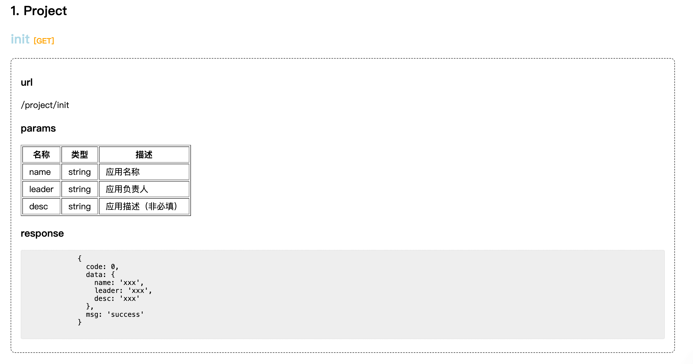
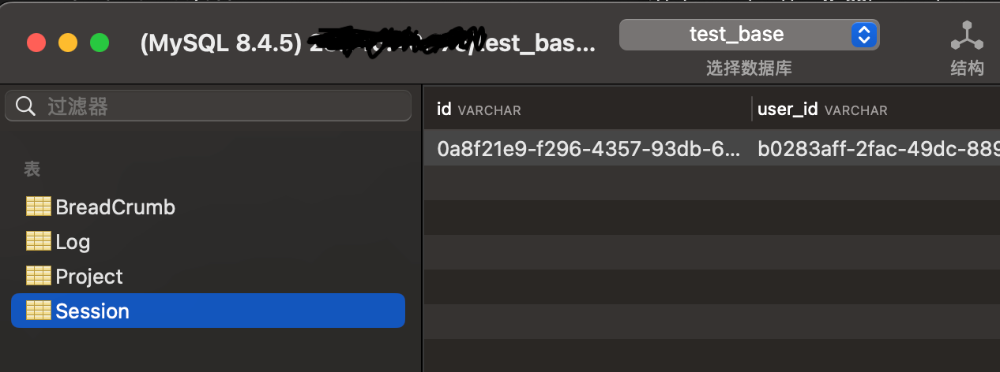

一款简单易用、轻量化、插件化的前端监控sdk

##  一、前置条件

- 确保已安装`Node.js`（建议v16+）和npm/pnpm环境
- 若使用本地数据库调试，需启动MySQL服务（默认端口3306）
- 若 **Heimdallr 服务端已独立部署**：
	- **确保服务端接口可访问**（如 `https://api.your-monitor.com`）。
	- **无需本地启动 MySQL**，直接连接服务端提供的上报接口。


## 二、环境准备与安装

### 1. 安装SDK

> 本文使用 browser

```shell
# 通过npm或pnpm安装核心包
pnpm add @heimdallr-sdk/browser  # 浏览器端
pnpm add @heimdallr-sdk/wx       # 微信小程序
pnpm add @heimdallr-sdk/node     # Node.js服务端
```

### 2. 配置本地服务和数据库
> 远端数据库直接连接上报接口即可，不赘述

#### 1. 下载与安装
- **Windows**(具体步骤请查阅相关文档)
    >  1. 访问 [MySQL 官方下载页](https://dev.mysql.com/downloads/mysql/)，选择 **MySQL Community Server**
    >  2. 运行安装程序，选择 **Developer Default** 配置
    >  3. 设置 root 用户密码（务必牢记，如 `root123`）
    >  4. 完成安装后，启动 **MySQL Server** 服务（默认端口 `3306`）
    
- **macOS**(本人使用的方案)
	```shell
	# 通过 Homebrew 安装
	brew install mysql
	brew services start mysql
	```
  
- **Linux (Ubuntu)**(具体步骤请查阅相关文档)
	```shell
    sudo apt update
    sudo apt install mysql-server
    sudo systemctl start mysql
	```

#### 2. 初始化
1. **登录数据库**
```bash
mysql -u root -p
```

2. 使用`prisma`初始化数据库
```bash
## 没有prisma可以全局或者局部安装
pnpm run prisma
```


3. **使用脚手架创建 heimdallr 服务**
```bash
## 全局安装脚手架
npm i @heimdallr-sdk/cli -g

## 使用脚手架命令选择监控服务模板
### 安装位置可以任意，最好是建一个固定文件夹存放监控项目数据
在指定目录下执行% heimdallr-create                   
? **Please select a template ?** server
? **Project name ?** heimdallr_server
? **Project version ?** 0.0.1
? **Project description ?** A @heimdallr-sdk monitor
? **Project author ?** username
? **Database name ?** test_base
? **Mysql host ?** localhost
? **Mysql port ?** 3306
? **Mysql user ?** root
? **Mysql password ?** root

   ╭──────────────────────────────────╮
   │   ✔ Success                      │
   │   heimdallr_server 创建完成 🎉     │
   │   您可以通过以下命令运行项目：        │
   │   $ cd heimdallr_server          │
   │   $ npm install                  │
   │   $ npm run dev                  │
   ╰──────────────────────────────────╯
```

3.  执行成功后访问给出的本地服务：`localhost:7001`，如下图：
	

#### 3. 安装图形化工具`sequel ace`
- appstore、github、brew都可以安装
### 3. SDK 配置与初始化

1. 在 `main.js` 或 `main.ts` 中初始化 SDK：
```js
import { createApp } from 'vue'
import App from './App.vue'
import heimdallr from '@heimdallr-sdk/browser'

// Heimdallr 配置
heimdallr({
  // 上报接口配置信息
  dsn: {
    host: "https://api.your-monitor.com", // 上报接口域名地址
    init: "/project/init",                // 应用初始化接口地址
    report: "/log/report"                 // 信息上报接口地址
  },
  // 应用信息
  app: {
    name: "ViteVueApp", // 应用名称
    leader: "YourName", // 负责人
    desc: "Production Environment" // 应用描述
  },
  // browser需要：用户标识（根据项目实际存储位置配置）
  userIdentify: {
    name: "user_id", // 业务字段名称（支持点运算符读取，cookie除外）
    position: "localStorage" // 存储位置：local/session/cookie/global。从 local 读取用户ID
  },
  // 可选，是否向后台发送事件: 默认 true
  // enabled： true,
  // 可选，面包屑最大层级: 默认 5
  // maxBreadcrumbs： 5,
  // 可选，插件集合
  // plugins： -,
  // 可选，控制台是否显示sdk输出信息: 默认 false
  // debug: false
})

createApp(App).mount('#app')
```

### 4.  验证数据存储

1. 触发前端事件生成日志

2. 查询数据库

3. 可以在数据库的相关表中找到数据：

   

## 三、监控服务的管理后台

### 1. 使用脚手架安装

```bash
## 全局安装脚手架，已安装的跳过
npm i @heimdallr-sdk/cli -g

## 使用脚手架命令选择监控服务模板
### 安装位置可以任意，最好是建一个固定文件夹存放监控项目数据
在指定目录下执行% heimdallr-create                   
? **Please select a template ?** client
? **Project name ?** heimdallr_client
? **Project version ?** 0.0.1
? **Project description ?** A @heimdallr-sdk monitor
? **Project author ?** username
? **Database name ?** test_base
? **API base url ?** localhost:7001 ## 这里我使用的是前面用脚手架启动的后端服务地址，可以根据实际情况更换

   ╭──────────────────────────────────╮
   │   ✔ Success                      │
   │   heimdallr_client 创建完成 🎉     │
   │   您可以通过以下命令运行项目：        │
   │   $ cd heimdallr_client          │
   │   $ npm install                  │
   │   $ npm run dev                  │
   ╰──────────────────────────────────╯
```

### 2. 解决跨域问题

```ts
// vite.config.ts
import { defineConfig } from 'vite';

export default defineConfig({
  // 增加这一段
  server: {
    proxy: {
      '/api': {
        target: 'http://localhost:7001/',
        changeOrigin: true,
        rewrite: (path) => path.replace(/^\/api/, '')
      }
    }
  }
});
```

如果还有问题，检查一下`env.devlopment`文件

```shell
## 检查VITE_API_URL这个值是否和跨域配置一致
VITE_API_URL='http://localhost:7001/'
```


#### 3. 使用其他插件

> 这里使用`@heimdallr-sdk/record`作为示例。这个插件是用来做录屏回放功能的。录屏依赖了rrweb播放器插件，可以去官网学习一下：https://github.com/rrweb-io/rrweb/blob/master/guide.zh_CN.md
> 

1. 安装
```bash
pnpm add  @heimdallr-sdk/record
```

2. 在`main.ts`中添加配置
```ts
import heimdallr from '@heimdallr-sdk/browser';
import recordPlugin from "@heimdallr-sdk/record";

heimdallr({
	dsn: {
		host: 'http://localhost:7001', // 远程服务端地址
		init: '/project/init', // 初始化接口
		report: '/log/report' // 数据上报接口
	},
	app: {
		name: 'AntdX_Chat',
		leader: 'Egg',
		desc: '本地环境'
	},
	userIdentify: {
		name: 'egg_chat_demo',
		position: 'local' // 从 local 读取用户ID
	},
	plugins: [
		plugins: [recordPlugin()], // 集成录屏插件，更多配置参数可以查询官网
	]
});

const app = createApp(App);

app.mount('#app');
```

3. 若遇到模块导入问题，可在 `vite.config.js` 中配置构建优化：
```ts
import { defineConfig } from 'vite';
import vue from '@vitejs/plugin-vue';

export default defineConfig({
  plugins: [vue()],
  build: {
    commonjsOptions: {
      transformMixedEsModules: true // 解决 CommonJS/ESM 兼容性问题
    }
  }
});
```

