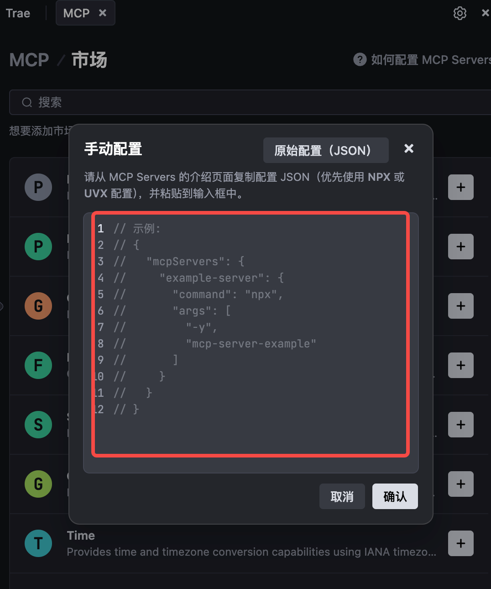

## 🎯 为什么选择线框图？

AI生成高保真原型看似高效，实际面临三大痛点：  

1️⃣ **风格割裂**：多页面生成像“拼图”，元素风格难统一  

2️⃣ **交互丢失**：动态效果常被降维成静态图稿  

3️⃣ **修改困难**：调整细节如同拆毛衣，有时想拆还拆不动，陷入死循环

不如回归线框图——设计界的「分镜脚本」：  

✅ 开发能快速理解架构逻辑  

✅ 产品可专注流程完整性  

✅ 前端/UI接手后自由发挥

✅（真实想法：线框图丑点怎么了，我毕竟是线框图🐶）


## 🛠️ 工具定位

- **Trae MCP智能体**：设计流程的「翻译官」，将自然语言转化为结构指令
  
  [什么是 MCP?](https://docs.trae.ai/ide/model-context-protocol?_lang=zh)
  
  > Model Context Protocol (MCP) 是一种协议，它允许大型语言模型（LLMs）访问自定义的工具和服务。Trae 中的智能体作为 MCP 客户端可以选择向 MCP Server 发起请求，以使用它们提供的工具。你可以自行添加 MCP Server，并添加到自定义的智能体中来使用。更多信息参阅 [MCP 官方文档](https://modelcontextprotocol.io/introduction)。
  >
  > 在 Trae IDE 中，MCP Server 支持两种传输类型：stdio 传输、SSE 传输。
  
  _Trae也可以换成([Claude Desktop](https://claude.ai/download), [Cursor](https://www.cursor.com/), etc.)其他工具。_
  
- **Frame0**：可协作的轻量原型工具，像写文档一样画线框

  [什么是 Frame0?](https://docs.frame0.app/getting-started/)

  > Frame0 是一款手绘风格线框图软件，可轻松快速地创建低保真线框。提供丰富的 UI 组件、图标和模板；支持多种图表类型，如流程图、UML 图等。手绘风格独特、轻量易用，基础功能免费，高级功能需要订阅
  >
  > 

二者配合如同「乐高说明书」：你说需求（中文Prompt），MCP翻译成机器指令，Frame0按规则组装组件。

## 🎬 接入指南

### 前置准备

- 安装[Trae编辑器](https://www.trae.ai/)
  
- 下载[Frame0](https://frame0.app/)

  

### 6步完成配置

1. 打开`trae`编辑器对话界面，选择对话框右上角设置图标，选择`MCP`

	  
	  

2. 点击`添加`
    

3. 选择`手动配置`
    

4. 在弹窗中填入 [Frame0 官网提供的代码](https://docs.frame0.app/ai-assistant/)：
    
	```json
	{
	  "mcpServers": {
	    "frame0-mcp-server": {
	      "command": "npx",
	      "args": ["-y", "frame0-mcp-server"]
	    }
	  }
	}
	```

	如果需要更改 API 服务器的端口号，可以使用如下格式：
	```json
	{  
		"mcpServers": {  
			"frame0-mcp-server": {  
				"command": "npx",  
				"args": ["-y", "frame0-mcp-server", "--api-port=3000"]  
			}  
		}  
	}
	```

6. 添加完成之后，在对话框中选择`@智能体`，点击`创建智能体`，取名，添加`MCP`
	
	

7. 可以在智能体菜单中勾选上`自动运行命令和MCP工具`，画图的时候更流畅。第一次使用在对话过程中也会有勾选提示，可以不用单独操作
    

8. 在对话框中选中刚才自定义的智能体进行对话，会让你打开一个`文件夹`。所以先打开`frame0`创建一个空页面，然后保存到本地文件夹中。然后打开文件夹时选择这个`frame0`文件夹即可，⚠️一定是文件夹：
	 
	
## 🔨 使用

> 官网提供了一些简单的提示词，可以先试试效果

- 基本使用和常规对话相似，选择合适的模型，说出你的准确需求，等待模型反馈
- 可以较好的理解中文`Prompt`，但是避免复杂修辞，可以让其他模型优化一下提示词再输出给模型
- 我使用的是海外版 `trae`， `Claude`、`Gemini` 模型经常都要排队，是真难等....国内版的`deepseek`模型也是可用的。

## 🤭 效果展示

> 以下效果都有进行人工调整，比如容器边距、组件命名规范


## 其他说明

1. 这几个可以理解为容器。你可以**指定使用的容器**进行创造页面
  

   比如：请使用 Browser 创建一个空白界面。同理，你也可以指定用其他组件生成图画

  

2. **复用组件**：区分组件 ID，以指定容器或者组件进行复制，并在指定的区域内进行绘制。比如，我先创建了一个组件，并让其在内容区域绘制表格
  

  ```text
  提示词：
  帮我创建一个使用 layout components组件，在MainContentArea添加内容的新页面，页面内容是：项目管理，可以增删改查中心，中心可以理解为一个组织，可以为个中心添加各自的项目，账号。并且有相应的筛选项。
  效果如下图：
  ```

  

3. 更多操作说明请移步至[官方文档](https://docs.frame0.app/designing/)查看

4. 这里主要补充一下我在使用时觉得很不方便的地方。

  - 特殊字体不支持中文，和整体风格不太搭...
  - 左侧的层级菜单不能像大多数原型编辑软件一样拖动直接改变层级，必须要选中组件手动调整（他的拖拽是镜像功能...emm...）。
  - 新增元素的时候如果你发现层级怎么调整都不对，你可以试一下调整元素的`Container`属性（有键盘快捷键，[查看文档](https://docs.frame0.app/designing/#container)）：
  	

## 写在最后
如果追求像素级完美，仍需专业设计工具。但作为「想法的脚手架」，这可能是很轻量的解决方案了。

另外，这种方案只能帮你省工作量，并不能省时间....建议在等待的过程中去做点别的😂