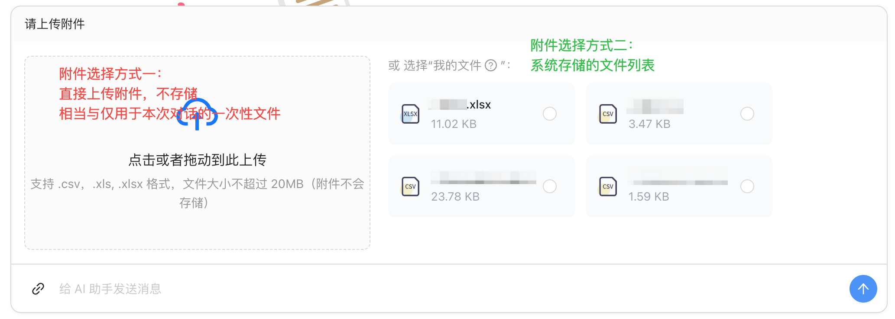

# AntD X Vue流式对话实战：实现Markdown渲染聊天机器人


## 💡 前言：当智能对话遇到技术难题

大模型出来后，对话需求蹭蹭上涨，之前手撸了几个对话 demo，费时费力，效果还不太满意。

我必须说：**Ant Design X 的出现，就像在沙漠里找到冰可乐一样爽！**（虽然它和官方[AntD X](https://x.ant.design/components/overview-cn)的关系...懂的都懂🤫）


使用过程中遇到并解决的一些问题：

1. 输入框展开面板会挤压页面，影响对话区域的展示
2. 输入框上传附件后需要展示并清除附件
3. 使用 `BubbleList` 渲染流式 `md` 格式数据（不会一段一段的显示，很丝滑）
4. 组件提供的 loading 方法无法使用在接口响应前
5. 组件提供的滚动触发的是浏览器自带的滚动条，会挤压页面（不好看）


## 🌟 安装

1. 首先按照[官方教程](https://antd-design-x-vue.netlify.app/development/introduce.html)安装`ant design x vue`。我使用的是`pnpm`安装

   ```shell
   pnpm add ant-design-x-vue --save
   ```

2. 本文中还使用到了`vue3`、`antdv4.x` 、`tailwindcss`、`ts` 、`pinia`、`scss`
3. 另外，我在使用`Ant Design X Vue`时官方还没有提供`setup`的组件示例，是我自己根据`tsx`改写的，若有和官方文档不一致的，请以官网为准。

### 自动导入

> 官方教程里都有，已配置的可以直接跳过

1. 安装 `unplugin-vue-components` 插件

   ```shell
   pnpm install unplugin-vue-components -D
   ```

   

2. 在 `Vite` 的配置文件中，添加以下依赖和插件

   ```ts
   // vite.config.ts
   import vue from '@vitejs/plugin-vue';
   import { defineConfig } from 'vite';
   
   // add the following dependencies
   import components from 'unplugin-vue-components/vite';
   import { AntDesignXVueResolver } from 'ant-design-x-vue/resolver';
   
   export default defineConfig({
     // ...
     plugins: [
       // add the following plugin
       components({
         resolvers: [AntDesignXVueResolver()]
       })
     ]
   });
   ```


3. 在项目中，以 `AX` 开头的组件，将被自动解析为 `ant-design-x-vue` 组件并导入到文件中，你可以直接在模板中使用它们：

   ```vue
   <script setup>
   // auto import equals to
   // import { Bubble as AXBubble } from 'ant-design-x-vue';
   </script>
   
   <template>
     <AXBubble content="Hello AI" />
   </template>
   ```


## 🛠️ 核心实现步骤

### 功能要点

1. 没有聊天内容时显示欢迎页面
2. 可以发送文本和附件（本文仅展示了 excel和 csv文件作为附件上传）
   - 附件可选择从本地上传，也可以选择’系统‘文件
   - 选择文件展示在输入框头部，支持预览和删除
3. 接口响应中（对话中）禁止发送消息
4. 渲染内容为流式输出的 md 文本格式
5. 需要自动滚动到最新输出内容
6. 接口响应前需要增加 `loading`
7. 对话数据全部使用 `pinia` 管理

### 代码结构

1. `pinia` 对话数据管理：`/src/store/moudles/dialogues.ts`

   

2. `AIChat.vue` 对话父级页面：`/src/components/chat/AIChat.vue`

   包含了欢迎页面、对话气泡列表和消息发送框。

   

   

2. `ChatBubble.vue` 子组件：对话气泡列表
3. `SenderInput` 子组件：消息发送框
4. `WelcomeIndex.vue` 子组件：欢迎页面（可以自由实现。下文会简单带过）


### 代码实现

#### 1. 数据管理`dialogues.ts`

```ts
// 文件路径：src/dataTypes/chatType.ts'

// 这个结构是根据 antd X Vue的 XChat 工具返回的数据结构定义的。所以对接的后端数据最好也能返回这个格式，如果不能的话需要前端自己转化
export interface MessageItem {
  id: string;
  message: string;
  status: 'local' | 'ai';
  loading?: boolean;
}
```


```ts
// 文件路径：/src/store/moudles/dialogues.ts
import { MessageItem } from '@/dataTypes/chatType.ts';

export const useDialogueStore = defineStore('dialogue', () => {
  const currentFile = ref<any>(); // 选中的附件
  const currentConversitionUuid = ref<string | undefined>(''); // 当前对话 uuid
  const dialogueRecord = ref<Array<MessageItem>>([]); // 对话记录
  const showHistory = ref<boolean>(false); // 是否是展示对话历史
  const isChatting = ref<boolean>(false); // 正在对话中

  // 获取上面定义的变量值
  const getCurrentFileUuid = computed(() => currentFile.value.uuid);
  const getCurrentFilename = computed(() => currentFile.value.filename);
  const getCurrentConversitionUuid = computed(
    () => currentConversitionUuid.value
  );
  const getDialogueRecord = computed(() => dialogueRecord.value);
  const getShowHistory = computed(() => showHistory.value);
  const getIsChatting = computed(() => isChatting.value);

  // 为上面定义的变量值赋值
  function setCurrentFileInfo(file: any) {
    currentFile.value = file;
  }

  function setCurrentConversitionUuid(uuid: string | undefined) {
    currentConversitionUuid.value = uuid;
  }

  function setDialogueRecord(record: MessageItem[]) {
    dialogueRecord.value = record;
  }

  function setIsChatting(status: boolean) {
    isChatting.value = status;
  }

  function setShowHistory(status: boolean) {
    showHistory.value = status;
  }

  function resetHistory() {
    currentConversitionUuid.value = undefined;
    dialogueRecord.value = [];
    showHistory.value = false;
  }

  return {
    getCurrentFileUuid,
    getCurrentFilename,
    getCurrentConversitionUuid,
    getDialogueRecord,
    getShowHistory,
    getIsChatting,
    setCurrentFileInfo,
    setCurrentConversitionUuid,
    setDialogueRecord,
    setIsChatting,
    setShowHistory,
    resetHistory
  };
});
```


#### 2. 父级页面`AIChat.vue`

> 实现对话页面整体布局

```vue
<template>
  <div ref="scholarAiRef" class="scholar-ai-chat-comp">
    <div class="content-wrap">
      <WelcomeIndex v-if="!messages.length" class="mb-4" />
      <ChatBubble
        v-else
        class="bubble-list-wrap mb-4"
        :messages="messages"
        :loading="waitResponse"
        @new-chat="resetChat"
      />
    </div>
    <div class="sender-wrap">
      <SenderInput
        ref="senderInputRef"
        @messages-change="handleMessagesChange"
        @loading-change="handleLoading"
      />
    </div>
  </div>
</template>

<script setup lang="ts">
import { useDialogueStore } from '@stores/modules/scholarDialogue';

const dialogueStores = useDialogueStore();
const chatHistory = computed(() => dialogueStores.getDialogueRecord);
const showHistory = computed(() => dialogueStores.getShowHistory);

// 在渲染聊天记录时，根据用户选择的历史对话实时更新页面
watch(
  () => chatHistory.value,
  (newChatHistory) => {
    if (showHistory.value) {
      messages.value = newChatHistory;
    }
  }
);

// 监听消息变化
const messages = ref<any[]>([]);
const handleMessagesChange = (newMessages: any[]) => {
  messages.value = newMessages;
};
  
// 等待对话响应
/**
 * 在用户将消息发出时触发 loading，接口响应，有返回值之后停止
 * 用户重置对话后，loading 也重置
 **/
const waitResponse = ref<boolean>(false); 
const handleLoading = (loading: boolean) => {
  waitResponse.value = loading;
};
  
// 重置对话
const senderInputRef = ref();
const resetChat = () => {
  waitResponse.value = false;
  senderInputRef.value?.newChat();
};
</script>

<style lang="scss" scoped>
.scholar-ai-chat-comp {
  position: relative;
  min-height: calc(100vh - 85px - 2rem);

  .content-wrap {
    padding-bottom: 56px; // 为固定定位的 SenderInput 预留空间
  }

  .sender-wrap {
    position: absolute;
    bottom: 0;
    z-index: 10;
    width: 100%;
    background: white;
  }

  .bubble-list-wrap {
    height: calc(100vh - 85px - 2rem - 1rem - 56px);
  }
}
</style>

```


#### 3. 子组件`SenderInput.vue`

> 用户发送消息，可以选择附件

- 用到了官网提供的`Sender`组件，地址在这：[Sender](https://antd-design-x-vue.netlify.app/component/sender.html)

- 使用了官方提供的 `useXAgent` 向模型发送消息，地址：[useXAgent](https://antd-design-x-vue.netlify.app/component/use-x-agent.html)

- 使用该组件的展开面板实现附件上传功能

- 对展开面板进行了改造，既可以直接上传附件，又能从文件列表中选择文件

- 对发送框进行了改造，选择的附件直接展示在消息框中，可以预览和删除

- 示例图片：

  

  

```vue
<template>
  <Sender
    class="sender-input-comp"
    :loading="senderLoading"
    :value="question"
    :disabled="showHistory"
    :placeholder="showHistory ? '历史对话不支持聊天' : '给 AI 助手发送消息'"
    @change="changeValue"
    @submit="sendMessage"
    @cancel="cancelSend"
  >
    <template #prefix>
      <a-space>
        <!-- 上传附件的按钮，点击会展开面板 -->
        <a-button :disabled="showHistory" type="text" @click="handleOpenHeader">
          <template #icon>
            <LinkOutlined />
          </template>
        </a-button>
				<!-- 自定义的文件名展示标签 -->
        <a-tag
          v-if="selectedFile"
          class="flex items-center gap-1"
          color="processing"
          :bordered="false"
          closable
          @close="handleRemoveFile"
        >
          <template #closeIcon>
						<!-- 删除按钮 -->
            <a-tooltip>
              <template #title>删除选中文件</template>
              <DeleteOutlined class="text-red-600" />
            </a-tooltip>
          </template>
          <span class="truncate max-w-[150px]" :title="selectedFile.filename">
            {{ selectedFile.filename }}
          </span>
					<!-- 预览按钮 -->
          <EyeOutlined
            class="cursor-pointer text-blue-600"
            @click="handlePreviewFile"
          />
        </a-tag>
      </a-space>
    </template>
		<!-- 点击附件按钮打开的面板 -->
    <template #header>
      <Sender.Header title="请上传附件" :open="openHeader" class="bg-white">
        <a-row :gutter="16">
          <a-col :span="10">
            <!-- 拖拽上传附件组件，这个也可以自己实现 -->
            <a-upload-dragger
              v-model:fileList="uploadFileList"
              :accept="accept"
              name="file"
              :showUploadList="false"
              :multiple="false"
              :maxCount="1"
              :disabled="uploadLoading"
              :customRequest="customRequest"
              @change="handleChange"
            >
              <div class="flex flex-col items-center justify-center h-full">
                <p class="ant-upload-drag-icon">
                  <LoadingOutlined v-if="uploadLoading" class="text-6xl" />
                  <CloudUploadOutlined v-else class="text-6xl" />
                </p>
                <p class="ant-upload-text">点击或者拖动到此上传</p>
                <p class="ant-upload-hint">
                  支持 .csv，.xls, .xlsx 格式，文件大小不超过
                  20MB（附件不会存储）
                </p>
              </div>
            </a-upload-dragger>
          </a-col>
          <a-col :span="14">
            <!-- 额外的文件列表，可以自己实现，我封装成了FilesList组件，就不展开说明了 -->
            <div class="upload-files-wrap">
              <div class="mb-1 ml-1">
                <a-typography-text type="secondary"
                  >或 选择“我的文件
                  <a-tooltip>
                    <template #title
                      >和系统文件列表同步，即列表搜索也会更新下方的数据</template
                    >
                    <QuestionCircleOutlined
                      class="hover:text-blue-600 cursor-pointer"
                    />
                  </a-tooltip>
                  ”：</a-typography-text
                >
              </div>

              <div class="scroll-list-wrap h-44 overflow-y-auto">
                <FilesList
                  :files="filesList"
                  :selectedFileUuid="selectedFileUuid"
                  @select="handleFileSelect"
                />
              </div>
            </div>
          </a-col>
        </a-row>
      </Sender.Header>
    </template>
  </Sender>
</template>

<script setup lang="ts">
import { Sender, useXAgent, useXChat } from 'ant-design-x-vue'; // 我没有使用自动导入，有需要的朋友可以按照官方教程配置
import { message as Msg } from 'ant-design-vue';
import { useUpload } from '@utils/upload';
import { uploadFileApi } from '@api/files';
import { chatStreamApi } from '@api/chat';
import { useFilesStore } from '@stores/modules/files';
import { useDialogueStore } from '@stores/modules/dialogue';
import { emitter, EventTypes } from '@utils/emitter';

interface ChatMessage {
  message: string;
  file_uuid?: string;
  conversation_uuid?: string;
}

interface selectedFileItem {
  id: string;
  uuid: string;
  filename: string;
  file_size: number;
  ext: string;
}

const emit = defineEmits(['messagesChange', 'loadingChange']);

const dialogueStores = useDialogueStore();
const showHistory = computed(() => dialogueStores.getShowHistory);
// 如果点开了历史对话，输入框的内容清空
watch(
  () => showHistory.value,
  (newVal) => {
    if (newVal) {
      handleRemoveFile();
      conversation_uuid.value = undefined;
      dialogueStores.setCurrentConversitionUuid(undefined);
    }
  }
);

/** 重置所有数据，开启了新对话 */
const newChat = () => {
  selectedFile.value = null;
  selectedFileUuid.value = '';
  conversation_uuid.value = undefined;
  messages.value = [];
  dialogueStores.resetHistory();
  dialogueStores.setCurrentConversitionUuid(undefined);
  emit('messagesChange', []);
};

defineExpose({
  newChat
});

/** 发送消息 */
const question = ref('');
const senderLoading = ref<boolean>(false);
const waitResponse = ref<boolean>(false);
const conversation_uuid = ref<string | undefined>(undefined);
let controller: AbortController; // 中断流式对话

// 使用了官方提供的 useXAgent 发送消息
const [agent] = useXAgent({
  request: async ({ message }, { onSuccess, onUpdate, onError }) => {
    controller = new AbortController();

    senderLoading.value = true; // 对话框发送按钮的 loading：只要对话还在输出就需要一直 loading
    waitResponse.value = true; // 在对话气泡中需要使用的 loading：只要接口响应了第一个 chunk 就停止 loading

    const chatData: ChatMessage = {
      message: message || '',
      file_uuid: selectedFile.value?.uuid,
      conversation_uuid: conversation_uuid.value,
    };

    // 读取流数据
    let fullContent = '';
    try {
      await chatStreamApi(
        chatData,
        (chunk: string) => {
           // 接口响应后对话气泡 loading 取消
          waitResponse.value = false;
          
          // 获取流式响应中的数据部分
          const jsonData = JSON.parse(chunk.replace('data: ', ''));
          conversation_uuid.value = jsonData.conversation_uuid;
          
          // 接口流式输出完毕标志
          if (jsonData.message === '[DONE]') {
            onSuccess(fullContent);
            return;
          }
          
          // 接受流中的回答内容并更新（我这里的流式数据已经对每段回答进行了拼接，所以进行了直接赋值。否则的化需要自己对 chunk 进行拼接）
          fullContent = jsonData.message;
          onUpdate(jsonData.message);
        },
        {
          maxRetries: 3, // 响应失败重试 3 次
          retryDelay: 1000, // 重试延迟 1000ms
          signal: controller.signal
        }
      );
    } catch (streamError: any) {
      Msg.error(streamError.message);
      onError(streamError);
    } finally {
      senderLoading.value = false;
      waitResponse.value = false;
    }
  }
});

// 使用了官方提供的 useXChat 进行流式对话
const { onRequest, messages } = useXChat({
  agent: agent.value
});

// 改变各组件依赖的变量
watch(messages, (newMessages) => {
  emit('messagesChange', newMessages);
});

watch(
  () => waitResponse.value,
  (newVal) => {
    if (typeof newVal === 'boolean') {
      emit('loadingChange', newVal);
    }
  },
  {
    flush: 'post'
  }
);

watch(
  () => senderLoading.value,
  (newVal) => {
    dialogueStores.setIsChatting(newVal);
  }
);

// 获取用户填写的问题
const changeValue = (val: string) => {
  question.value = val;
};

// 发送消息
const sendMessage = (value: any) => {
  onRequest(value);
  question.value = '';
  openHeader.value = false;
};

// 取消发送消息/停止消息响应
const cancelSend = () => {
  if (controller) {
    controller.abort();
  }
  waitResponse.value = false;
  question.value = '';
  senderLoading.value = false;
};

/** 上传附件 **/
const openHeader = ref<boolean>(false);
const handleOpenHeader = () => {
  openHeader.value = !openHeader.value;
};
// 上传方法
const {
  uploadLoading,
  uploadFileList,
  customRequest,
  handleChange,
  accept = '.csv, .xlsx, .xls'
} = useUpload({
  uploadRequest: uploadFileApi,
  requestParams: {
    isAttachment: true
  },
  onSuccess: (file: any) => {
    selectedFile.value = {
      id: file.id,
      uuid: file.id,
      filename: file.name,
      file_size: file.size,
      ext: file.type
    };
    selectedFileUuid.value = '';
    openHeader.value = false;
  },
  maxSize: 20 // 20MB
});

// 已有的文件列表
const filesStore = useFilesStore();
const filesList = computed(() => {
  return filesStore.getFileList;
});
// 选中文件
const selectedFile = ref<selectedFileItem | null>(null);
const selectedFileUuid = ref<string>(''); // 用来再次打开是选中文件卡片

const handleFileSelect = (file: selectedFileItem) => {
  dialogueStores.setCurrentFileInfo(file);
  selectedFile.value = file;
  selectedFileUuid.value = file.uuid;
  openHeader.value = false; // 关闭上传面板
};
// 文件预览，是个单独的组件，本文不进行说明
const handlePreviewFile = () => {
  emitter.emit(EventTypes.PREVIEW_FILE, selectedFile.value as any);
};
// 文件删除
const handleRemoveFile = () => {
  selectedFile.value = null;
  selectedFileUuid.value = '';
};

// 监听selectedFile 和conversation_uuid，有变化就给dialogueStores 赋值
watch(
  [() => selectedFile.value, () => conversation_uuid.value],
  ([newFile, newUuid]) => {
    dialogueStores.setCurrentFileInfo(newFile);
    dialogueStores.setCurrentConversitionUuid(newUuid);
  }
);

onMounted(() => {
  emitter.on(EventTypes.SEND_CODE_MESSAGE, (code: any) => {
    sendMessage(code.message);
  });
});

onUnmounted(() => {
  emitter.off(EventTypes.SEND_CODE_MESSAGE);
});
</script>

```

#### 4. 子组件`ChatBubble.vue`

> 流式对话，自定义渲染为 md格式

- 使用了官网提供的 `Bubble` 和 `BubbleList` 组件，地址在这：[Bubble](https://antd-design-x-vue.netlify.app/component/bubble.html)
- 在接口响应前展示`loading`
- 自动滚动到底部（自定义不占位滚动条）
- 这里使用的是`BubbleList`组件渲染`md`格式的流式内容，官方没有给出明确的示例，但应该是这么用的😁
- `md` 预览组件使用的是`v-md-editor`，官方地址：[VMdPreview](https://code-farmer-i.github.io/vue-markdown-editor/zh/examples/preview-demo.html)
- 使用了`SimpleBar` 滚动条插件，不占位不挤压页面，只用滚动时出现，其余时候不会显示。但是会使`BubbleList`自带的滚动效果失效，需要自己实现滚动。（按需取舍即可）。官方地址：[SimpleBar](https://www.npmjs.com/package/simplebar)

```vue
<template>
  <div>
    <div class="handle-list-wrap mb-3">
      <a-flex justify="space-between">
        <a-button type="primary" @click="newChat">
          <template #icon>
            <CommentOutlined />
          </template>
          新对话
        </a-button>
    </div>
    <div ref="bubbleListContentRef" class="bubble-list">
      <BubbleList :roles="roles" :items="messageItemList" />

      <!-- 单独使用一个 Bubble 作为 loading 是因为使用官方的 loading 方法存在一些问题。具体问题...有点难以用文字描述清楚，但是我又不想贴代码了。有可能是我使用方式不对，有兴趣的小伙伴可以先使用官方方法，然后留下你的建议哦～ -->
      <Bubble
        v-if="loading"
        :loading="loading"
        :avatar="roles.ai.avatar"
        :placement="roles.ai.placement"
      />
    </div>
  </div>
</template>

<script lang="ts" setup>
import { Bubble, BubbleList } from 'ant-design-x-vue';
import { message as Msg, Avatar } from 'ant-design-vue';
import { useDialogueStore } from '@stores/modules/dialogue';
import { emitter, EventTypes } from '@utils/emitter';
// md 格式渲染组件，我将v-md-editor进行了 2 次封装，直接用官方的也是可以的
import MdPreview from '@/components/root/MdPreview.vue'; 
import { useUserStore } from '@stores/modules/user';
import { MessageItem } from '@/dataTypes/chatType.ts';
// 滚动条插件
import SimpleBar from 'simplebar';

const props = defineProps({
  messages: {
    type: Array as PropType<MessageItem[]>,
    default: () => []
  },
  loading: {
    type: Boolean,
    default: false
  }
});

const emit = defineEmits(['newChat']);
  
// 这里是为了获取用户名作为对话中的用户头像，也可以自己设置
const userStore = useUserStore();
const username = computed(() => userStore.getUsername);

const dialogueStores = useDialogueStore();
const chatUuid = computed<string>(
  () => dialogueStores.getCurrentConversitionUuid || ''
);
const isChatting = computed<boolean>(
  () => dialogueStores.getIsChatting || false
);
const showHistory = computed(() => dialogueStores.getShowHistory);

// 新对话
const newChat = () => {
  messageItemList.value = [];
  emit('newChat');
};

// 渲染对话
  
// 图标我用到了 Iconfont 库，可以使用别的图标替换
  
// @ts-expect-error 取消对window的检查
const IconFont = window.IconFont;

// 这里是定义气泡列表中 用户 和 AI 两种气泡样式，包括显示位置、头像和头像样式
const roles: (typeof Bubble.List)['roles'] = {
  ai: {
    placement: 'start',
    avatar: {
      icon: h(IconFont, {
        type: 'AI'
      }),
      style: {
        borderColor: '#fde3cf',
        background: 'unset',
        fontSize: '16px'
      }
    }
  },
  local: {
    placement: 'end',
    avatar: {
      icon: h(
        Avatar,
        {
          style: {
            color: '#f56a00',
            background: '#fde3cf',
            lineHeight: '26px'
          }
        },
        () => username.value.slice(0, 1)
      ),
      style: {
        background: 'unset'
      }
    }
  }
};

// 用于渲染气泡列表的数据
const messageItemList = ref<(typeof Bubble.List)['items']>([]);

watch(
  () => props.messages,
  (newMessage) => {
    // 更新为最新的消息列表
    messageItemList.value =
      newMessage?.map(({ id, message, status }) => ({
        key: id,
        // 将 status和对话角色对应起来。
        // 官方的 status 有 loading 状态，不是 ai。只是这个 loading 和我的需求不太一样，我没有用。
        role: status === 'local' ? 'local' : 'ai',
        content: message,
      	// 自定义渲染：
        // @ts-expect-error-next-line 暂时忽略content类型
        messageRender: (content) =>
      		// 这里直接将md预览组件放进去就可以了，{}花括号内是我二次封装的组件需要的参数，按需调整。
          h(MdPreview, {
            text: content,
            needScroll: false
          })
      })) || [];

    // 自己实现的滚动方法
    scrollToBottom();
  },
  { immediate: true }
);

/** message变化时自动滚动到底部 */
let simpleBarInstance: SimpleBar | null = null;
const bubbleListContentRef = ref<HTMLElement | null>(null);

function scrollToBottom() {
  nextTick(() => {
    const scrollElement = simpleBarInstance?.getScrollElement();
    if (scrollElement) {
      scrollElement.scrollTo({
        top: scrollElement.scrollHeight,
        behavior: 'smooth'
      });
    }
  });
}

// 和自定义滚动条相关，onMounted时创建实例，onUnmounted时解绑销毁实例
onMounted(() => {
  if (bubbleListContentRef.value) {
    simpleBarInstance = new SimpleBar(bubbleListContentRef.value);
  }
});

onUnmounted(() => {
  if (simpleBarInstance) {
    simpleBarInstance.unMount();
    simpleBarInstance = null;
  }
});
</script>

<style lang="scss" scoped>
.bubble-list {
  height: calc(100% - 32px - 0.75rem);
}
</style>
```


#### 5. 子组件`WelcomeIndex.vue`

> 没有对话内容时的欢迎页面，仅供参考

- 使用了官网提供的`Welcome`组件，地址：[Welcome](https://antd-design-x-vue.netlify.app/component/welcome.html)

- 使用了官网提供的`Prompts`组件，地址：[Prompts](https://antd-design-x-vue.netlify.app/component/prompts.html)

```vue
<template>
  <div class="welcome-wrap">
    <Welcome
      icon="../../assets/page/logo.svg"
      :title="welcomeTitle"
      :description="welcomeDescription"
      :style="welcomeStyle"
    >
      <template #icon>
        <icon-font class="scholar-logo" type="AI" />
      </template>
    </Welcome>
    <div class="welcome-image"></div>
    <Prompts
      title="✨ xxxxxx"
      :items="promptItems"
      wrap
      :styles="promptStyle"
    />
  </div>
</template>

<script setup lang="ts">
import { Welcome, Prompts, type PromptsProps } from 'ant-design-x-vue';
import {
  BulbOutlined,
  InfoCircleOutlined,
  RocketOutlined
} from '@ant-design/icons-vue';

const welcomeTitle = '您好！我是xxxxx。';
const welcomeDescription =
  '我可以帮您xxxxxx。请问有什么可以帮您？';
const welcomeStyle = {
  background: 'linear-gradient(97deg, #fafafa 0%, #f8f0e9 100%)',
  borderStartStartRadius: 4
};

const promptItems: PromptsProps['items'] = [
  {
    key: 'xxx',
    icon: h(BulbOutlined, { style: { color: '#FFD700' } }),
    label: 'xxx',
    description: 'xxx'
  },
  {
    key: 'xxx',
    icon: h(InfoCircleOutlined, { style: { color: '#1890FF' } }),
    label: 'xxxxx',
    description: 'xxxx'
  },
  {
    key: 'xxx',
    icon: h(RocketOutlined, { style: { color: '#722ED1' } }),
    label: 'xxx',
    description: 'xxx'
  }
];
const promptStyle = {
  item: {
    flex: 'none',
    width: 'calc(33% - 6px)'
  }
};
</script>

<style scoped lang="scss">
.welcome-wrap {
  .scholar-logo {
    font-size: 3.5rem;
  }

  .welcome-image {
    height: calc(100vh - 85px - 2rem - 82px - 106px - 1rem - 56px);
    background-image: url('@/assets/svgIcons/welcome.svg');
    background-repeat: no-repeat;
    background-position: center;
    background-size: cover;
  }
}
</style>
```


## 🤔 沉思时间

虽然 `AntD X Vue` 用着真香，但必须说句大实话：
⚠️ 文档里的坑得自己填

不过...比起从头造轮子，我选择站在巨人的肩膀上🐒

**最后送大家一句话**：
"能用第三方库解决的问题，千万不要自己写！"


------

> **免责声明**：本文示例代码均经过脱敏处理，仅供技术交流参考。

------

