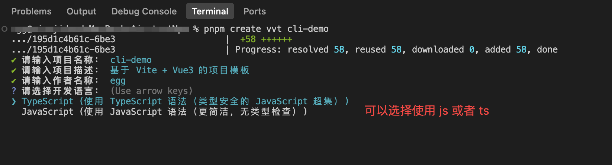
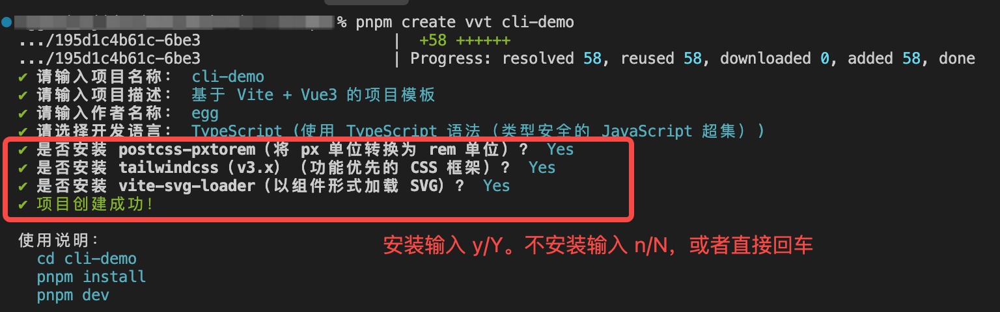
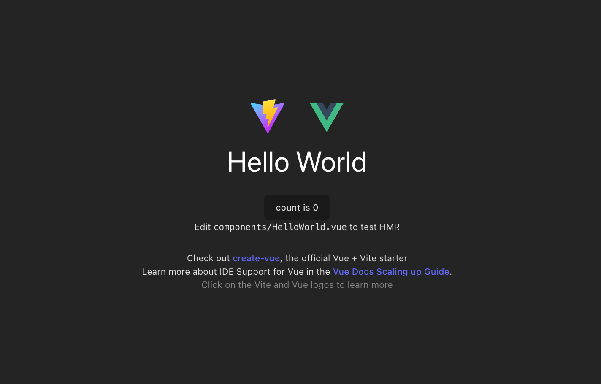
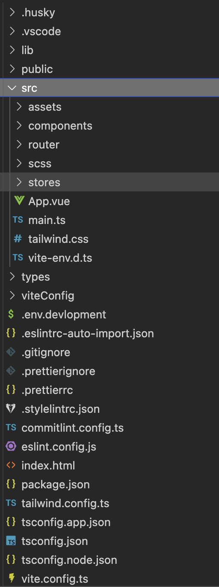
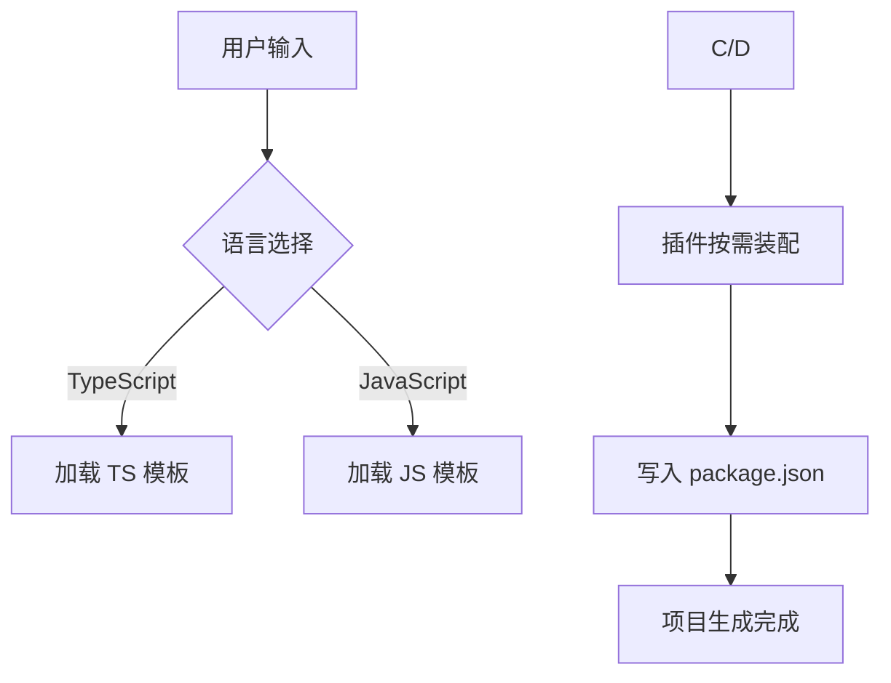

# 从零发布一个 Vite+Vue3 脚手架：动态生成项目与多平台发布

## 背景：从「重复 CV 工程师」到「自动化工具开发者」

在团队开发中，每次新建项目都要经历「复制老项目 → 疯狂删文件 → 重写配置」的循环。

为了解决这个问题，我给自己写了一个支持 **TypeScript/JavaScript 双版本**、**插件按需加载**的脚手架工具，并成功发布到 npm 和 GitHub Packages。

本文将分享完整实现过程。

## 一、成果预览：一行命令搞定项目初始化

### 核心特性

1. **零配置启动**

   ```shell
   pnpm create vvt [项目名称]
   ```

2. **语言按需选择**

   

3. **插件化架构**

   1. `postcss-pxtorem`：在设计图转页面的时候比较好用
   2. `tailwindcss`：减轻想类名、编写大量 css的苦恼，but 协同开发维护起来也有点难顶
   3. `vite-svg-loader`：如果项目中有较多的 svg 文件，推荐使用

   

4. 按照使用说明启动项目，结果如下：

   

## 二、环境准备

- `Node.js（>=18.12.0，推荐 20 LTS）`
- `pnpm（>=8.0.0）`
- `npm 账号 / GitHub 账号`
- `Vite 脚手架基础模板`

> 💡 **为什么放宽版本要求？** 原项目要求 Node >= 21，但这个版本是非 LTS 版本，大多数团队还在用 Node 18/20。脚手架应该松版本约束，避免用户因本地环境而无法使用。

## 三、初始化项目

### 1. 准备基础模板

我是使用的`vite`脚手架创建了一个基础框架，然后添加了一些基础配置，作为自己的脚手架基础。项目结构概览如下，具体配置可以参考我的[**搭建一个自己的开箱即用的 VUE 脚手架**](https://juejin.cn/post/7485677817868140559) 和 [为 VUE 脚手架添加开发常用的插件/配置 ](https://juejin.cn/post/7485725589610512399) 这两篇文章。



调整为能发布成脚手架的结构，整体结构如下：

```shell
├── bin
│   └── cli.js         # 命令行入口
├── templates          # 项目模板
│   ├── typescript     # TS 版本模板，里面的代码就是上面准备的基础模板
│   └── javascript     # JS 版本模板，根据 TS 进行部分删减
├── gitignore          # node_modules、.npmrc文件一定要放进来！！
├── .npmrc             # 填写 github packages 注册表 token
├── LICENSE            # 许可文件
├── package.json       # 会进行一些发布配置
├── publish-github.js  # 自动化发布脚本
└── README.md          # 脚手架使用说明文件
```

### 2. 创建`bin/cli.js`文件

```js
#!/usr/bin/env node

console.log('hello vvt')
...主内容
```

`#!`开头标识这个文件被当做执行文件，可以当做脚本运行。后面的`/usr/bin/env node`表示文件用node执行，基于用户安装根目录下的环境变量中查找node

### 3. 修改` package.json`

```json
{
  "name": "create-vvt", // 脚手架的名称，若要发布到 npm，必须唯一
  "version": "0.1.0", // 每次发布需要更新版本号
  "type": "module",
  "description": "一个基于 Vite + Vue3 + TypeScript/JavaScript 的项目模板脚手架",
  "bin": {
    "create-vvt": "bin/cli.js", // ⚠️ 必须同时有 create-vvt 和 vvt 两个 key
    "vvt": "bin/cli.js"         // pnpm dlx 要求 bin 名与包名一致，npm 无此限制
  },
  "files": [
    "bin",
    "templates"
  ],
  "engines": {
    "node": ">=18.12.0",
    "pnpm": ">=8.0.0"
  },
  "publishConfig": {
    "access": "public",
    "registry": "https://registry.npmjs.org"
  }
}
```

> ⚠️ **bin 字段的两个 key**：这是踩坑后得出的结论。`pnpm dlx create-vvt` 会优先查找名为 `create-vvt` 的 bin，如果找不到就直接报错 `'create-vvt' 不是内部或外部命令`。而 npm 有 fallback 机制（取第一个 bin），所以 npm 用户不受影响。同时保留 `vvt` 是为了兼容 `pnpm create vvt` 和直接的 `vvt` 命令调用。

### 4. 本地测试

使用`npm link`将这个项目链接到全局，进行测试。关于链接方法的具体操作可以在[vite+ts发布 npm 包过程记录](https://juejin.cn/post/7485677817868386319#heading-13)这里找到。测试成功之后就进行核心代码部分了。

## 四、关键实现细节

> - **用户输入校验**：项目名非空检测
> - **模板选择**：TS/JS 双版本支持
> - **插件按需加载**：Tailwind CSS 等动态配置

### 1. 核心依赖

```shell
pnpm add chalk commander inquirer ora
# 用于构建用户友好的交互界面
```

| 工具        | 作用           | 官方文档                                        |
| :---------- | :------------- | :---------------------------------------------- |
| `commander` | 命令行参数解析 | [文档链接](https://npmjs.com/package/commander) |
| `inquirer`  | 交互式问答     | [文档链接](https://npmjs.com/package/inquirer)  |
| `chalk`     | 终端输出美化   | [文档链接](https://npmjs.com/package/chalk)     |
| `ora`       | 加载动画       | [文档链接](https://npmjs.com/package/ora)       |

### 2. 动态生成项目模板



1. 定义可选的插件和语言选项

   ```js
   // 定义可选插件
   const PLUGINS = [
     {
       name: 'postcss-pxtorem',// 用在命令行显示
       value: 'pxtorem',
       description: '将 px 单位转换为 rem 单位',// 用在命令行显示
       devDependencies: {
         'postcss-pxtorem': '^6.1.0'
       }
     }
     ...其他插件
   ];
   
   // 语言选项
   const LANGUAGES = {
     typescript: {
       name: 'TypeScript',
       value: 'typescript',
       description: '使用 TypeScript 语法（类型安全的 JavaScript 超集）',
       templateDir: 'templates/typescript' // 对应模板所在文件夹路径
     },
     javascript: {
       name: 'JavaScript',
       value: 'javascript',
       description: '使用 JavaScript 语法（更简洁，无类型检查）',
       templateDir: 'templates/javascript'
     }
   };
   ```

   

2. 基于`commander`执行自定义命令指令，准备创建项目

   ```js
   // 初始化命令行工具
   import { Command } from 'commander';
   const program = new Command();
   
   program
     .name('create-vite-vue3-ts')
     .description('基于 Vite + Vue3 的项目模板生成工具')
     .version('0.1.0')
     .argument('[project-name]', '项目名称')
     .action(async (projectName) => {
       try {
         await createProject(projectName); // 使用action绑定主逻辑函数
       } catch (error) {
         console.error(chalk.red('错误：') + error.message);
         process.exit(1);
       }
     });
   program.parse(process.argv);
   ```

   

3. 使用`inquirer`收集用户输入，如项目名称、描述、作者等

   ```js
   // 创建项目主逻辑函数createProject
   // 1. 获取项目名称
   const { name, description, author } = await inquirer.prompt([
     {
       type: 'input',
       name: 'name',
       message: '请输入项目名称：',
       default: projectName || 'vite-vue3-project',
       // 对输入添加校验逻辑，避免空值
       validate: (input) => {
         if (!input.trim()) {
           return '项目名称不能为空';
         }
         return true;
       }
     },
     {
       type: 'input',
       name: 'description',
       message: '请输入项目描述：',
       default: '基于 Vite + Vue3 的项目模板'
     },
     {
       type: 'input',
       name: 'author',
       message: '请输入作者名称：',
       default: 'egg'
     }
   ]);
   
   // 2. 选择语言
   const { language } = await inquirer.prompt([
     {
       type: 'list',
       name: 'language',
       message: '请选择开发语言：',
       choices: Object.values(LANGUAGES).map((lang) => ({
         name: `${lang.name} (${lang.description})`,
         value: lang.value
       })),
       default: 'typescript'
     }
   ]);
   ```

4. 检查用户计划创建的文件是否存在，存在的话需要覆盖

   ```js
   const targetDir = path.join(process.cwd(), name); // name是用户填写的项目名
   
   if (fs.existsSync(targetDir)) {
       const { overwrite } = await inquirer.prompt([
         {
           type: 'confirm',
           name: 'overwrite',
           message: `目标目录 ${chalk.cyan(name)} 已存在。是否要覆盖？`,
           default: true
         }
       ]);
   
       if (!overwrite) {
         throw new Error('操作取消');
       }
   
       const spinner = ora('正在清理目录...').start();
   
       await fs.promises.rm(targetDir, { recursive: true, force: true });
       spinner.succeed(chalk.green('目录清理完成'));
     }
   ```


5. 指导用户选择安装插件

   ```js
   // 逐个选择插件
   const selectedPlugins = [];
   for (const plugin of PLUGINS) {
     const { install } = await inquirer.prompt([
       {
         type: 'confirm',
         name: 'install',
         message: `是否安装 ${plugin.name}（${plugin.description}）？`,
         default: false
       }
     ]);
     if (install) {
       selectedPlugins.push(plugin.value);
     }
   }
   ```


6. 创建项目

   ```js
   // 1. 创建项目Loading初始化
   const spinner = ora(chalk.bgYellow('正在创建项目...')).start();
   // 2. 根据选择的语言选择对应模板进行复制，也可以把模板文件放到 github上，复制操作换成从仓库下载，这样模板更新不用更新脚手架，用户也能直接使用。
   const templateDir = path.resolve(
     __dirname,
     '..',
     LANGUAGES[language].templateDir
   );
   fs.mkdirSync(targetDir, { recursive: true });
   await copyTemplate(templateDir, targetDir);
   // 3. 更新配置文件
   spinner.text = '正在更新配置文件...';
   // 这个方法是针对选择的插件对模板文件内容进行修改
   await updateProjectFiles(targetDir, selectedPlugins, {
     name,
     description,
     author,
     language
   });
   // 这个方法是针对选择的插件修改下载依赖配置
   await updatePackageJson(targetDir, selectedPlugins, {
     name,
     description,
     author
   });
   // 4. loading结束
   spinner.succeed(chalk.green('项目创建成功！'));
   
   // 5. 输出使用说明
   console.log('\n使用说明：');
   console.log(chalk.cyan(`  cd ${name}`));
   console.log(chalk.cyan('  pnpm install'));
   console.log(chalk.cyan('  pnpm dev\n'));
   ```

   

7. `updateProjectFiles`和`updatePackageJson`部分代码示例

   ```js
   /** updateProjectFiles 根据用户选择处理tailwindcss插件
    ** 主要需要修改导入路径，和类型导入的处理
    ** 其他插件处理方式类似 
   */
   
   // 根据选择的语言决定入口文件的扩展名
   const mainExtension = projectInfo.language === 'typescript' ? '.ts' : '.js';
   const mainPath = path.join(root, `src/main${mainExtension}`);
   
   // 处理 CSS 配置文件
   const cssConfigExtension =
     projectInfo.language === 'typescript' ? '.ts' : '.js';
   const cssConfigPath = path.join(
     root,
     `viteConfig/css/index${cssConfigExtension}`
   );
   
   // 根据选择的插件修改配置
   if (fs.existsSync(cssConfigPath)) {
     let cssConfig = fs.readFileSync(cssConfigPath, 'utf-8');
   
     // 处理 tailwindcss 插件
     if (!selectedPlugins.includes('tailwind')) {
       // 如果没有安装，则删掉导入代码
       cssConfig = cssConfig.replace(/import tailwindcss.*;\n/, '');
       cssConfig = cssConfig.replace(/\s*tailwindcss\(\),?\n?/, '');
       mainContent = mainContent.replace(/import '\.\/tailwind.css';\n/, '');
   		// 删掉tailwind.css配置文件
       const tailwindPath = path.join(root, 'src/tailwind.css');
       if (fs.existsSync(tailwindPath)) {
         fs.unlinkSync(tailwindPath);
       }
   		// 删掉tailwind.config.js/ts配置文件
       const tailwindConfigExtension =
         projectInfo.language === 'typescript' ? '.ts' : '.js';
       const tailwindConfigPath = path.join(
         root,
         `tailwind.config${tailwindConfigExtension}`
       );
       if (fs.existsSync(tailwindConfigPath)) {
         fs.unlinkSync(tailwindConfigPath);
       }
     }
   	// 重写 vite css配置文件 和main文件
     fs.writeFileSync(cssConfigPath, cssConfig);
     fs.writeFileSync(mainPath, mainContent);
   }
   ```

   ```js
   /** updatePackageJson 根据用户选择处理安装依赖配置 */
   const pkgPath = path.join(root, 'package.json');
   const pkg = JSON.parse(fs.readFileSync(pkgPath, 'utf-8'));
   
   // 获取选中插件的依赖
   const devDependencies = {};
   for (const plugin of PLUGINS.filter((p) =>
     selectedPlugins.includes(p.value)
   )) {
     Object.assign(devDependencies, plugin.devDependencies);
   }
   
   // 更新 package.json
   pkg.devDependencies = {
     ...pkg.devDependencies,
     ...devDependencies
   };
   
   // 移除未选中插件的依赖
   PLUGINS.forEach((plugin) => {
     if (!selectedPlugins.includes(plugin.value)) {
       Object.keys(plugin.devDependencies).forEach((dep) => {
         delete pkg.dependencies[dep];
         delete pkg.devDependencies[dep];
       });
     }
   });
   
   fs.writeFileSync(pkgPath, JSON.stringify(pkg, null, 2));
   ```

## 五、自动版本管理与双平台发布（changesets + GitHub Actions）

手动改版本号 + 手动发布容易出错。实际项目中改用 **changesets** + **GitHub Actions** 实现自动化版本管理和双平台发布。

### 发布流程总览

```
开发 → pnpm changeset → 提交 → PR 合并到 cli 分支
                                      ↓
                            GitHub Actions 自动触发
                                      ↓
                      ┌───────────────┴──────────────┐
                      ↓                               ↓
            changesets publish                  publish-github.js
            (npm registry)                     (GitHub Packages)
           create-vvt@x.y.z              @star-devil/create-vvt@x.y.z
```

### 1. 安装 changesets

```bash
pnpm add -D @changesets/cli
```

创建 `.changeset/config.json`：

```json
{
  “$schema”: “https://unpkg.com/@changesets/config@3.1.1/schema.json”,
  “changelog”: “@changesets/cli/changelog”,
  “commit”: false,
  “access”: “public”,
  “baseBranch”: “cli”
}
```

> 💡 `baseBranch` 是关键配置，指向你的发布分支。单包项目不需要 `ignore`、`fixed`、`linked` 等字段。

### 2. 配置 package.json

```json
{
  “packageManager”: “pnpm@11.10.0”,
  “bin”: {
    “create-vvt”: “bin/cli.js”,
    “vvt”: “bin/cli.js”
  },
  “scripts”: {
    “changeset”: “changeset”,
    “changeset:version”: “changeset version”,
    “changeset:publish”: “changeset publish”,
    “github:publish”: “node publish-github.js”
  },
  “engines”: {
    “node”: “>=18.12.0”,
    “pnpm”: “>=8.0.0”
  },
  “publishConfig”: {
    “access”: “public”,
    “registry”: “https://registry.npmjs.org”
  }
}
```

> ⚠️ **`bin` 字段必须同时包含 `create-vvt` 和 `vvt`**。`pnpm dlx create-vvt` 严格按包名查找 bin，找不到就直接报错。npm 有 fallback 所以不受影响。

### 3. 创建 GitHub Actions 工作流

`.github/workflows/release.yml`：

```yaml
name: Release

on:
  push:
    branches:
      - cli

concurrency: ${{ github.workflow }}-${{ github.ref }}

jobs:
  release:
    name: Release
    runs-on: ubuntu-latest
    permissions:
      contents: write
      packages: write
      pull-requests: write
    steps:
      - uses: actions/checkout@v4
        with: { fetch-depth: 0 }

      - uses: pnpm/action-setup@v4
        with:
          version: 10  # ⚠️ 锁版本！latest(11) 要求 Node >= 22

      - uses: actions/setup-node@v4
        with:
          node-version: 20
          cache: 'pnpm'

      # 显式配置 .npmrc，确保 pnpm publish 能拿到 token
      - name: Setup npm auth
        run: |
          echo “//registry.npmjs.org/:_authToken=${{ secrets.NPM_TOKEN }}” >> .npmrc
          echo “registry=https://registry.npmjs.org” >> .npmrc

      - run: pnpm install --frozen-lockfile

      - name: Create Release PR or Publish to npm
        id: changesets
        uses: changesets/action@v1
        with:
          publish: pnpm changeset publish
          version: pnpm changeset version
          commit: 'chore: version packages'
          title: 'chore: version packages'
        env:
          GITHUB_TOKEN: ${{ secrets.GITHUB_TOKEN }}
          NPM_TOKEN: ${{ secrets.NPM_TOKEN }}

      - name: Publish to GitHub Packages
        if: steps.changesets.outputs.published == 'true'
        env:
          GITHUB_TOKEN: ${{ secrets.GITHUB_TOKEN }}
        run: node publish-github.js
```

### 4. GitHub Secrets 配置

在仓库 `Settings → Secrets and variables → Actions` 添加：

| Secret      | 值                           | 说明                                                                                                               |
| ----------- | --------------------------- | ---------------------------------------------------------------------------------------------------------------- |
| `NPM_TOKEN` | npm 的 Granular Access Token | npmjs.com → Access Tokens → New Granular Access Token → 选 “All packages” + “Read and write”，**如果npm开了2fa必须 2FA** |

`GITHUB_TOKEN` 是 Actions 自动注入的，无需手动配置。

### 5. 发布操作

```bash
# 日常开发：创建 changeset
pnpm changeset
# 按提示选择版本类型（patch / minor / major）并写变更说明
git add . && git commit -m “feat: xxx”
git push

# changesets 会自动创建 “Version Packages” PR
# Merge 该 PR → 自动发布到 npm + GitHub Packages
```

### 6. publish-github.js（双平台发布脚本）

```js
import fs from 'fs';
import { execSync } from 'child_process';

if (!process.env.GITHUB_TOKEN) {
  console.error('错误: GITHUB_TOKEN 环境变量未设置');
  process.exit(1);
}

try {
  const pkg = JSON.parse(fs.readFileSync('./package.json', 'utf8'));

  // 备份
  fs.writeFileSync('./package.json.backup', JSON.stringify(pkg, null, 2));

  // GitHub Packages 要求 scoped 包名
  pkg.name = '@star-devil/create-vvt';
  pkg.publishConfig = {
    registry: 'https://npm.pkg.github.com',
    access: 'public'
  };

  fs.writeFileSync('./package.json', JSON.stringify(pkg, null, 2));
  console.log('Modified package.json for GitHub Packages');

  // 使用 pnpm 发布
  execSync('pnpm publish', { stdio: 'inherit' });
  console.log('Published to GitHub Packages successfully!');
} catch (error) {
  console.error('Error:', error);
} finally {
  if (fs.existsSync('./package.json.backup')) {
    fs.copyFileSync('./package.json.backup', './package.json');
    fs.unlinkSync('./package.json.backup');
    console.log('Restored original package.json');
  }
}
```

### 7. 仓库必要设置

`Settings → Actions → General → Workflow permissions`：
- 选 **”Read and write permissions”**
- 勾上 **”Allow GitHub Actions to create and approve pull requests”**


## 六、发布踩坑记录

### 坑 1：Windows 上 pnpm store 双路径缓存

**现象**：`pnpm create vvt` 始终下载旧版代码，即使 `latest` tag 已指向新版本。清空 `pnpm store prune` 和 npm 缓存都不管用。

**根因**：Windows 上 pnpm 在每个盘符都有一个独立的 store（`C:\Users\<name>\AppData\Local\pnpm\store` 和 `D:\.pnpm-store`）。`pnpm dlx` 解析包时先在本地 store 查找元数据，如果 C 盘 store 还残留旧版本的链接，就直接用了，根本不去查 npm registry。

**解决**：两个 store 全部删除重建：

```powershell
Remove-Item -Recurse -Force "D:\.pnpm-store"
Remove-Item -Recurse -Force "C:\Users\$env:USERNAME\AppData\Local\pnpm\store"
```

### 坑 2：bin 字段缺少 `create-vvt` 导致 pnpm dlx 报错

**现象**：`pnpm dlx create-vvt@latest` 报 `'create-vvt' 不是内部或外部命令`，但 `npm create vvt@latest` 正常。

**根因**：npm 的 `exec` 在找不到同名 bin 时会 fallback 到第一个 bin。pnpm 不做 fallback，严格按包名查找。

**解决**：

```json
"bin": {
  "create-vvt": "bin/cli.js",  // 必加！pnpm 用的
  "vvt": "bin/cli.js"          // 兼容旧命令
}
```

### 坑 3：pnpm/action-setup 版本与 Node 版本不兼容

**现象**：GitHub Actions 报 `node:sqlite` 模块不存在。

**根因**：`pnpm/action-setup@v4` 的 `version: latest` 在 2025 年解析到 pnpm v11，它要求 Node >= 22，但 workflow 配置了 `node-version: 20`。

**解决**：锁 pnpm 版本到 v10：

```yaml
- uses: pnpm/action-setup@v4
  with:
    version: 10  # 不用 latest
```

### 坑 4：NPM_TOKEN 类型不对导致 404

**现象**：`changesets publish` 报 `E404 Not Found - PUT https://registry.npmjs.org/create-vvt`。

**根因**：npm 的 Automation Token 才能用于 CI 无交互发布。Publish 类型需要 2FA 验证，CI 无法响应。

**解决**：在 npm 生成 **Granular Access Token** → 选 "All packages" → "Read and write" → 勾上 ”Bypass two-factor authentication (2FA)”

### 坑 5：GitHub Actions 无法创建 PR

**现象**：changesets 报 `GitHub Actions is not permitted to create pull requests`。

**解决**：仓库 `Settings → Actions → General → Workflow permissions` → 选 "Read and write permissions" + 勾选 "Allow GitHub Actions to create and approve pull requests"。

## 七、完整源码与使用指南

- **GitHub 仓库**: [vite-vue3-ts-cli](https://github.com/star-devil/vite-vue3-ts-cli/tree/cli)
- **npm 安装**: [create-vvt](https://www.npmjs.com/package/create-vvt)

```bash
# 推荐：始终加 @latest 避免缓存问题
pnpm create vvt@latest [项目名称]
```

> 📝 本文记录了从手动发布到 changesets 自动化的完整演进过程。踩过的坑都列在第六章了，希望能帮你少走弯路～
